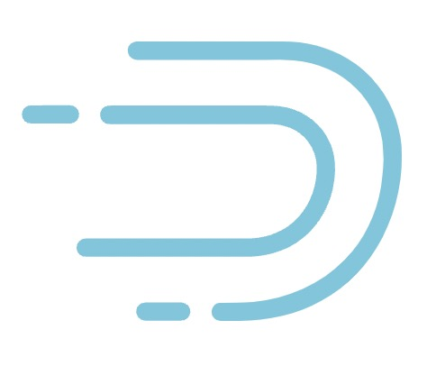

# DataCap (incubator)

DataCap is integrated software for data transformation, integration and visualization.

### Require

---

> Must-read for users: Be sure to execute the following command after cloning the code locally

```bash
cp configure/git-hook/* .git/hooks
chmod 700 .git/hooks/*
```

## Contributors

---


## Supported Databases

---

DataCap can query data from any SQL-speaking datastore or data engine (ClickHouse, MySQL, Presto and more).

Here are some of the major database solutions that are supported:

<div align="center">
    <div align="center">
        <div align="center">
            <div align="center">
            <div align="center">
                <div align="center">
                    <code>
                        <a href="https://clickhouse.com" target="_blank">
                            
                        </a>
                    </code> <br />
                </div>
                <code>
                    <a href="https://www.mysql.com" target="_blank">
                        
                    </a>
                    <a href="https://prestodb.io/" target="_blank">
                        
                    </a>
                </code> <br />
            </div>
            <code>
                <a href="https://redis.io/" target="_blank">
                    
                </a>
                <a href="https://www.postgresql.org/" target="_blank">
                    
                </a>
                <a href="https://trino.io/" target="_blank">
                    
                </a>
            </code> <br />
        </div>
        <code>
            <a href="https://www.elastic.co/" target="_blank">
                
            </a>
            <a href="https://druid.apache.org/" target="_blank">
                
            </a>
            <a href="https://kyuubi.apache.org/" target="_blank">
                
            </a>
            <a href="https://hive.apache.org/" target="_blank">
                
            </a>
        </code> <br />
      </div>
    </div>
</div>

## Stargazers over time

---

[](https://starchart.cc/EdurtIO/incubator-datacap)

## Overview

---


[](https://github.com/EdurtIO/incubator-datacap)


## Join Us

---

Open the DingTalk software and scan the following QR code to join

</img>

## Thank you

---

- [Jetbrains](https://www.jetbrains.com/)

## Installation and Configuration

---

[Extended documentation for DataCap](https://datacap.incubator.edurt.io)
