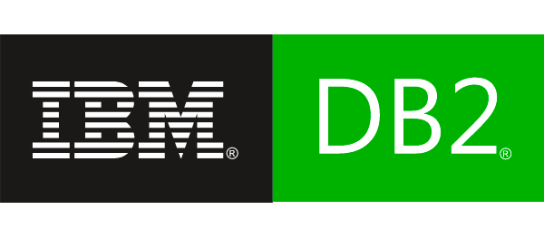
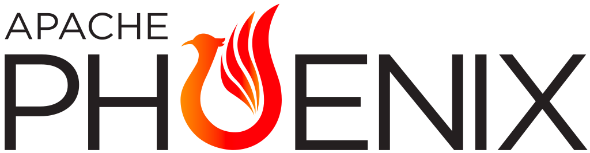
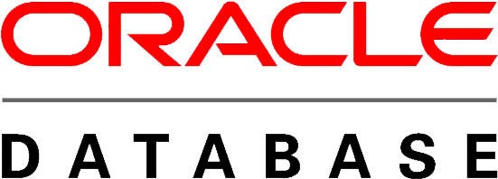

# DataCap (incubator)

DataCap is integrated software for data transformation, integration and visualization.

### Require

---

> Must-read for users: Be sure to execute the following command after cloning the code locally

```bash
cp configure/git-hook/* .git/hooks
chmod 700 .git/hooks/*
```

## Supported Databases

---

DataCap can query data from any SQL-speaking datastore or data engine (ClickHouse, MySQL, Presto and more).

Here are some of the major database solutions that are supported:

<p align="center">
    <a href="https://clickhouse.com" target="_blank">
        
    </a>&nbsp;
    <a href="https://www.mysql.com" target="_blank">
        
    </a>&nbsp;
    <a href="https://prestodb.io/" target="_blank">
        
    </a>&nbsp;
    <a href="https://redis.io/" target="_blank">
        
    </a>&nbsp;
    <a href="https://www.postgresql.org/" target="_blank">
        
    </a>&nbsp;
    <a href="https://trino.io/" target="_blank">
        
    </a>&nbsp;
    <a href="https://www.elastic.co/" target="_blank">
        
    </a>&nbsp;
    <a href="https://druid.apache.org/" target="_blank">
        
    </a>&nbsp;
    <a href="https://kyuubi.apache.org/" target="_blank">
        
    </a>&nbsp;
    <a href="https://hive.apache.org/" target="_blank">
        
    </a>&nbsp;
    <a href="https://kylin.apache.org" target="_blank">
        
    </a>&nbsp;
    <a href="https://ignite.apache.org/" target="_blank">
        
    </a>&nbsp;
    <a href="https://www.ibm.com/db2/" target="_blank">
        
    </a>&nbsp;
    <a href="https://www.mongodb.com/" target="_blank">
        
    </a>&nbsp;
    <a href="https://www.dremio.com/" target="_blank">
        
    </a>&nbsp;
    <a href="https://www.monetdb.org/" target="_blank">
        
    </a>&nbsp;
    <a href="https://phoenix.apache.org/" target="_blank">
        
    </a>&nbsp;
    <a href="https://www.h2database.com/html/main.html" target="_blank">
        
    </a>&nbsp;
    <a href="https://www.microsoft.com/sql-server" target="_blank">
        
    </a>&nbsp;
    <a href="https://www.oracle.com/" target="_blank">
        
    </a>&nbsp;
    <a href="https://crate.io/" target="_blank">
        
    </a>&nbsp;
    <a href="https://www.dameng.com/DM8.html" target="_blank">
        
    </a>&nbsp;
    <a href="https://tdengine.com/" target="_blank">
        
    </a>
</p>

## Stargazers over time

---

[](https://starchart.cc/EdurtIO/incubator-datacap)

## Overview

---


[](https://github.com/EdurtIO/incubator-datacap)


## Join Us

---

Open the DingTalk software and scan the following QR code to join

</img>

## Thank you

---

- [Jetbrains](https://www.jetbrains.com/)

## Installation and Configuration

---

[Extended documentation for DataCap](https://datacap.incubator.edurt.io)

## Contributors

---

<a href="https://github.com/EdurtIO/incubator-datacap/graphs/contributors">
  
</a>
