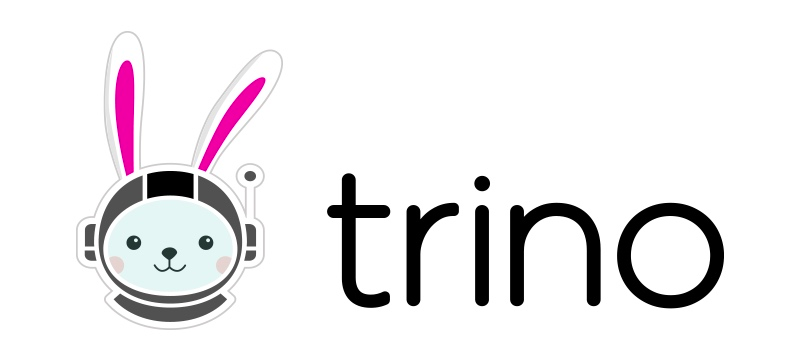
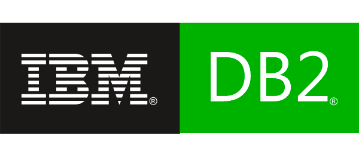
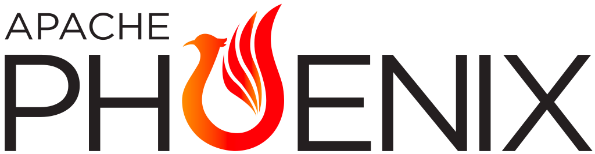
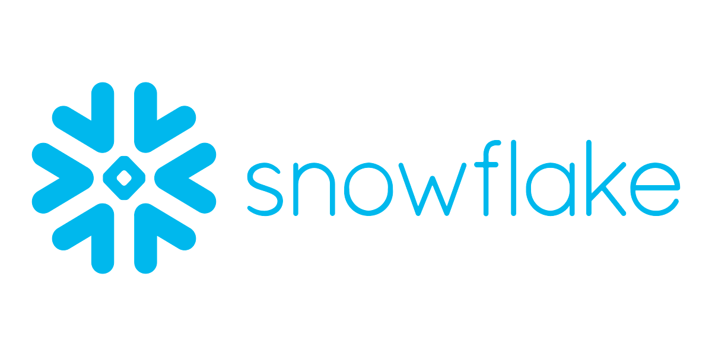
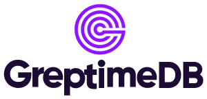
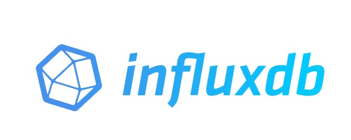
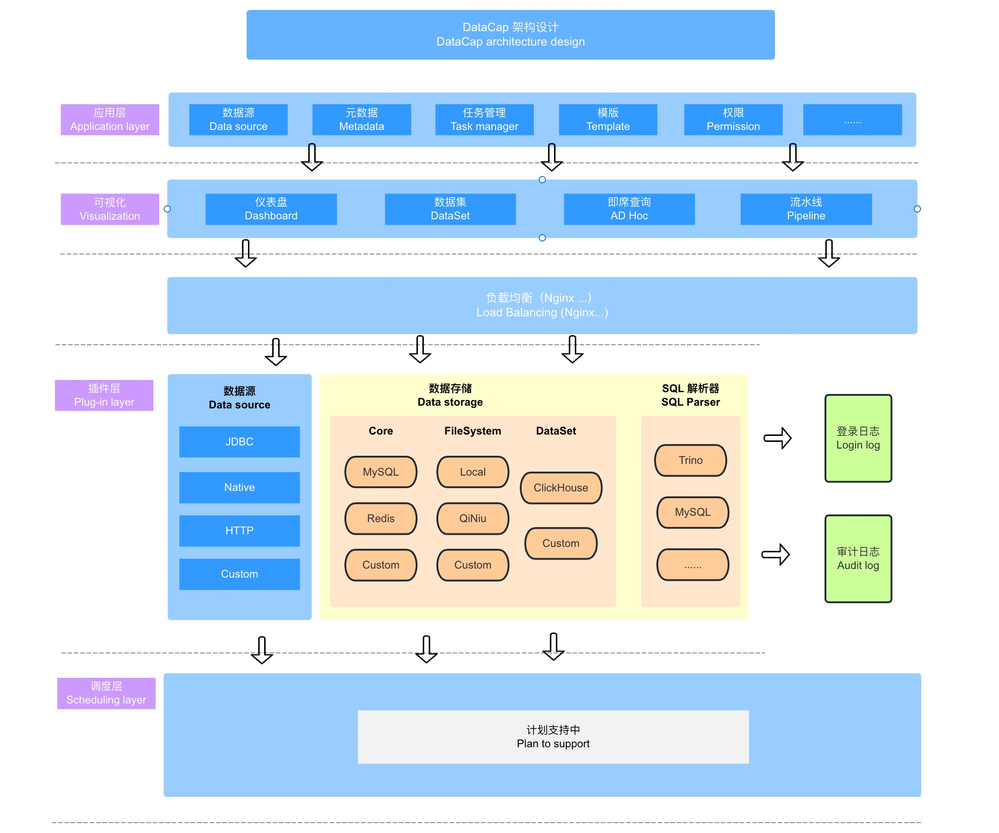

<div align="center">


# DataCap

---


[](https://github.com/EdurtIO/datacap)


[](https://opensource.org/licenses/Apache-2.0)


</div>

### What is datacap?

---

DataCap is integrated software for data transformation, integration, and visualization. Support a variety of data sources, file types, big data related database, relational database, NoSQL database, etc. Through the software can realize the management of multiple data sources, the data under the source of various operations conversion, making data charts, monitoring data sources and other functions.

**Example**: [try.datacap.devlive.org](http://try.datacap.devlive.org/)

| Username  | Password    |
|:---------:|:------------|
| `datacap` | `123456789` |
|  `admin`  | `12345678`  |

### Require

---

> Must-read for users: Be sure to execute the following command after cloning the code locally

```bash
cp configure/git-hook/* .git/hooks
chmod 700 .git/hooks/*
```

## Supported Connectors

---

DataCap can query data from any SQL-speaking datastore or data engine (ClickHouse, MySQL, Presto and more).

Here are some of the major database solutions that are supported:

|                  <a href="https://clickhouse.com" target="_blank"></a>                  |                             <a href="https://redis.io/" target="_blank"></a>                              |              <a href="https://www.postgresql.org/" target="_blank"></a>              |                              <a href="https://prestodb.io/" target="_blank"></a>                               |                       <a href="https://www.mysql.com" target="_blank"></a>                        |
|:------------------------------------------------------------------------------------------------------------------------------------------------------------------------:|:-------------------------------------------------------------------------------------------------------------------------------------------------------------------------------:|:--------------------------------------------------------------------------------------------------------------------------------------------------------------------:|:--------------------------------------------------------------------------------------------------------------------------------------------------------------------------------------:|:-----------------------------------------------------------------------------------------------------------------------------------------------------------------------:|
|                       <a href="https://hive.apache.org/" target="_blank"></a>                       |                        <a href="https://kyuubi.apache.org/" target="_blank"></a>                        |                   <a href="https://druid.apache.org/" target="_blank"></a>                    |                     <a href="https://www.elastic.co/" target="_blank"></a>                      |                         <a href="https://trino.io/" target="_blank"></a>                          |
|                      <a href="https://kylin.apache.org" target="_blank"></a>                      |                       <a href="https://ignite.apache.org/" target="_blank"></a>                        |                  <a href="https://www.ibm.com/db2/" target="_blank"></a>                   |                           <a href="https://www.mongodb.com/" target="_blank"></a>                           |                     <a href="https://www.dremio.com/" target="_blank"></a>                     |
|                    <a href="https://www.monetdb.org/" target="_blank"></a>                    |                      <a href="https://phoenix.apache.org/" target="_blank"></a>                      |              <a href="https://www.h2database.com/html/main.html" target="_blank"></a>               |                   <a href="https://www.microsoft.com/sql-server" target="_blank"></a>                   |                     <a href="https://www.oracle.com/" target="_blank"></a>                     |
|                       <a href="https://crate.io/" target="_blank"></a>                        |                     <a href="https://www.dameng.com/DM8.html" target="_blank"></a>                     |                  <a href="https://tdengine.com/" target="_blank"></a>                   |                           <a href="https://impala.apache.org/" target="_blank"></a>                           |                <a href="https://www.oceanbase.com/" target="_blank"></a>                 |
|                         <a href="https://neo4j.com/" target="_blank"></a>                         |                         <a href="https://iotdb.apache.org/" target="_blank"></a>                         |               <a href="https://www.snowflake.com/" target="_blank"></a>               |                                  <a href="https://ydb.tech/" target="_blank"></a>                                   |               <a href="https://zookeeper.apache.org/" target="_blank"></a>               |
|                       <a href="https://duckdb.org/" target="_blank"></a>                        |   <a href="https://www.alibabacloud.com/zh/product/object-storage-service" target="_blank"></a>    |                <a href="https://kafka.apache.org" target="_blank"></a>                 |                           <a href="https://docs.ceresdb.io/" target="_blank"></a>                           | <a href="https://docs.greptime.com/" target="_blank" class="connector-logo-index"></a> |
|        <a href="https://questdb.io/" target="_blank" class="connector-logo-index"></a>        |       <a href="https://doris.apache.org/" target="_blank" class="connector-logo-index"></a>       | <a href="https://www.starrocks.io/" target="_blank" class="connector-logo-index"></a> | <a href="https://www.alibabacloud.com/product/hologres" target="_blank" class="connector-logo-index"></a> |    <a href="https://hadoop.apache.org/" target="_blank" class="connector-logo-index"></a>    |
| <a href="https://docs.pinot.apache.org/" target="_blank" class="connector-logo-index"></a> | <a href="https://cassandra.apache.org/" target="_blank" class="connector-logo-index"></a> | <a href="https://matrixorigin.cn/" target="_blank" class="connector-logo-index"></a>  |           <a href="https://www.scylladb.com/" target="_blank" class="connector-logo-index"></a>           |   <a href="https://www.paradedb.com/" target="_blank" class="connector-logo-index"></a>    |
|  <a href="https://www.timescale.com/" target="_blank" class="connector-logo-index"></a>   |        <a href="https://solr.apache.org/" target="_blank" class="connector-logo-index"></a>         | <a href="https://www.influxdata.com/" target="_blank" class="connector-logo-index"></a> |                                                                                                                                                                                        |                                                                                                                                                                         |

## System architecture

---



## Stargazers over time

---

[](https://star-history.com/#devlive-community/datacap&Timeline)

## Join Us

---

Open the DingTalk (left) or WeChat(right) software and scan the following QR code to join

<div>
  
  
</div>

## Thank you

---

[](https://www.jetbrains.com/)
[](https://www.rainbond.com/)
[](https://www.iviewui.com/view-ui-plus)

## Installation and Configuration

---

[Extended documentation for DataCap](https://datacap.devlive.org)

## Contributors

---

<a href="https://github.com/EdurtIO/datacap/graphs/contributors">
  
</a>
