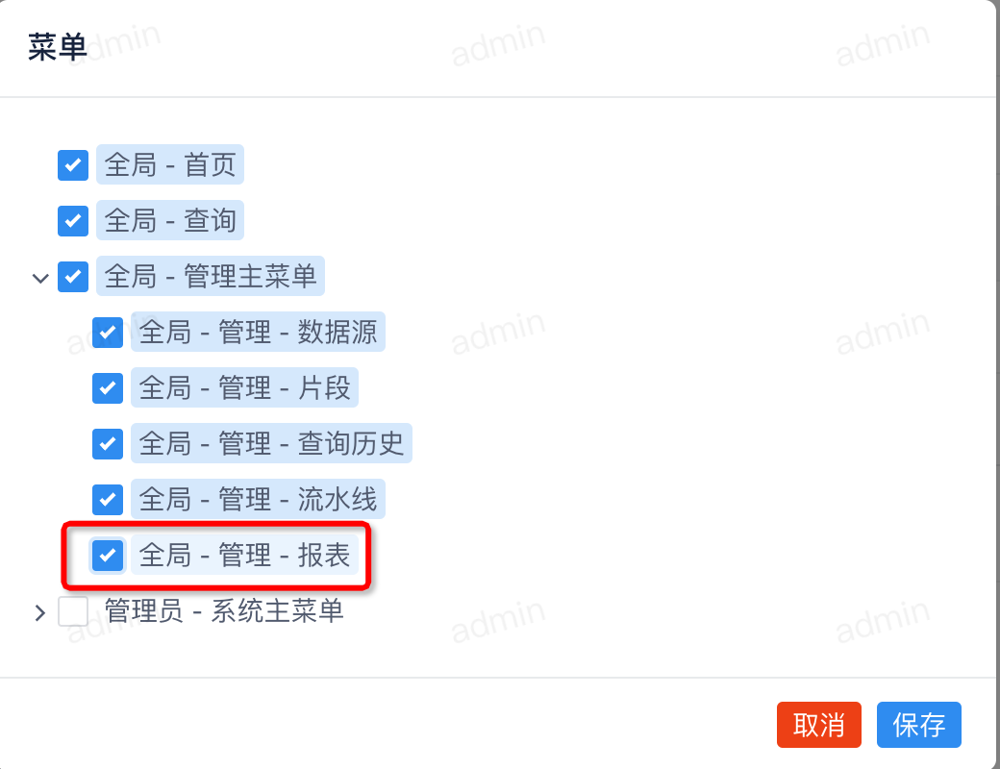

本文章主要用来介绍如何集成在 datacap 中开发新的功能。我们这里以 github 中的 [issues-481](https://github.com/devlive-community/datacap/issues/481) 为例来讲解。

## 准备工作

---

**重要** 克隆源码到本地（如果您需要提交代码到主仓库中需要先将源码 fork 到您的 github 账户中）

```bash
git clone https://github.com/devlive-community/datacap.git
```

!!! note

    如果您已经 fork 源码到您的账户中，请将 `devlive-community` 替换为您的 github 账户的 ID

**重要** 以下是基本的环境配置

| 环境                          | 版本            | 必需 |
|:----------------------------|:--------------|:---|
| `JDK`                       | `1.8` \| `11` | 必须 |
| `Maven`                     | >= 3.5        | 可选 |
| `IDEA` \| `Eclipse` \| `其他` | 任意版本          | 必须 |

!!! note

    在本文中我们使用的是 `IDEA` 编辑器环境，用户可以根据自己喜好更换相应编辑器。

可参考 [服务端](../server/home.md) 文档中的 `加载源码到 IDEA` 部分。

## 源码开发

---

针对于源码开发分为以下部分：

- 服务端
- [可选] UI 端
- [可选] 文档 (**如果增加了新功能，涉及到 UI 建议添加文档方便用户快速了解使用方式**)

### 服务端

---

服务端的源码大致可以分为以下部分：

- `entity` ： 数据模型
- `repository`： 数据库操作
- `service`： 业务逻辑
- `controller`： 接口
- `sql`： SQL 语句

以上三个部分在 datacap 中已经提供相应的基础支持，如果没有特殊的需求可以直接使用提供的基础功能，该示例中我们不做特殊的需求开发，只用到 datacap 提供的基础功能。

#### 添加 `entity`

---

在 datacap 中提供了 `BaseEntity` 类，可以作为基础的实体类使用。它提供了以下属性：

- `id`：主键
- `name`：名称
- `active`：是否激活
- `create_time`：创建时间
- `update_time`：更新时间

我们新建 `ReportEntity` 类，代码如下：

```java
import edu.umd.cs.findbugs.annotations.SuppressFBWarnings;
import io.edurt.datacap.service.enums.ReportType;
import lombok.AllArgsConstructor;
import lombok.Data;
import lombok.EqualsAndHashCode;
import lombok.NoArgsConstructor;
import lombok.ToString;
import lombok.experimental.SuperBuilder;
import org.springframework.data.jpa.domain.support.AuditingEntityListener;

import javax.persistence.Column;
import javax.persistence.Entity;
import javax.persistence.EntityListeners;
import javax.persistence.EnumType;
import javax.persistence.Enumerated;
import javax.persistence.JoinColumn;
import javax.persistence.JoinTable;
import javax.persistence.ManyToOne;
import javax.persistence.Table;

@Data
@SuperBuilder
@ToString
@NoArgsConstructor
@AllArgsConstructor
@EqualsAndHashCode(callSuper = true)
@Entity
@Table(name = "datacap_report")
@EntityListeners(AuditingEntityListener.class)
@SuppressFBWarnings(value = {"EI_EXPOSE_REP", "EQ_OVERRIDING_EQUALS_NOT_SYMMETRIC"})
public class ReportEntity
        extends BaseEntity
{
    @Column(name = "configure")
    private String configure;

    @Column(name = "type")
    @Enumerated(EnumType.STRING)
    private ReportType type;

    @ManyToOne
    @JoinTable(name = "datacap_report_user_relation",
            joinColumns = @JoinColumn(name = "report_id"),
            inverseJoinColumns = @JoinColumn(name = "user_id"))
    private UserEntity user;
}
```

!!! warning

    代码中的 `@SuperBuilder` 一定要添加，不然我们无法使用父类提供的 builder 方法。

`@Table(name = "datacap_report")` 这里我们需要修改表名，格式为 `datacap_${表名}`。

在以上示例中我们增加了三个属性 (根据功能的情况而定需要的属性)：

- `configure`：配置
- `type`：类型
- `user`：用户关联信息

#### 添加 `repository`

---

我们新建 `ReportRepository` 接口，代码如下：

```java
package io.edurt.datacap.service.repository;

import io.edurt.datacap.service.entity.ReportEntity;
import org.springframework.data.repository.PagingAndSortingRepository;

public interface ReportRepository
        extends PagingAndSortingRepository<ReportEntity, Long>
{
}
```

如果没有特殊需求，这里我们使用 JPA 提供的默认方法，无需自己实现。

#### 添加 `service`

---

在 datacap 中提供了 `BaseService` 类，可以作为基础的实体类使用。它提供了以下属性：

- `getAll` 根据指定的过滤器获取所有数据
- `getById` 根据指定的 ID 获取数据
- `saveOrUpdate` 保存或更新数据
- `deleteById` 删除指定的 ID 数据

我们新建 `ReportService` 类，代码如下：

```java
package io.edurt.datacap.service.service;

import io.edurt.datacap.service.entity.ReportEntity;

public interface ReportService
        extends BaseService<ReportEntity>
{
}

```

添加实现类 `ReportServiceImpl`，代码如下：

```java
package io.edurt.datacap.service.service.impl;

import io.edurt.datacap.service.service.ReportService;
import org.springframework.stereotype.Service;

@Service
public class ReportServiceImpl
        implements ReportService
{
}

```

!!! note

    如果没有特殊的需求，实现类可以不添加。

#### 添加 `controller`

---

在 datacap 中提供了 `BaseController` 类，可以作为基础的实体类使用。它提供了以下属性：

- `list` 根据指定的过滤器获取所有数据
- `saveOrUpdate` 保存或更新数据
- `delete` 删除指定的 ID 数据
- `deleteForPath` 根据指定的路径删除数据
- `getInfoForPath` 根据指定的路径获取数据

我们新建 `ReportController` 类，代码如下：

```java
package io.edurt.datacap.server.controller;

import io.edurt.datacap.service.entity.ReportEntity;
import io.edurt.datacap.service.repository.ReportRepository;
import io.edurt.datacap.service.service.ReportService;
import org.springframework.web.bind.annotation.RequestMapping;
import org.springframework.web.bind.annotation.RestController;

@RestController()
@RequestMapping(value = "/api/v1/report")
public class ReportController
        extends BaseController<ReportEntity>
{
    private final ReportRepository repository;
    private final ReportService service;

    protected ReportController(ReportRepository repository, ReportService service)
    {
        super(repository, service);
        this.repository = repository;
        this.service = service;
    }
}

```

`@RequestMapping(value = "/api/v1/report")` 这里我们需要修改表名，格式为 `/api/v1/${路由}`.

!!! danger

    一定要将自定义 controller 的构造函数中的参数修改为相关的具体类。

#### 添加 `sql`

---

!!! note

    如果没有新增 SQL 相关可以忽略此步骤。

通过以上步骤已经提供了 API，底层处理相关类，剩下的需要我们添加对于功能实现的相关 SQL 语句。

将 SQL 语句添加到 `datacap.sql` 文件中，格式如下：

```sql
# If you are upgrading to 1.18.0 from a different version, execute the following SQL statement
# Если вы обновляетесь до версии 1.18.0 с другой версии, выполните следующую инструкцию SQL
# 如果您是通过其他版本升级到 1.18.0, 请执行以下 SQL 语句

CREATE TABLE `datacap_report`
(
    `id`          BIGINT AUTO_INCREMENT PRIMARY KEY,
    `name`        VARCHAR(255),
    `active`      BOOLEAN DEFAULT TRUE,
    `create_time` DATETIME,
    `update_time` DATETIME,
    `configure`   LONGTEXT,
    `type`        VARCHAR(255)
);

CREATE TABLE `datacap_report_user_relation`
(
    `report_id` BIGINT,
    `user_id`   BIGINT
);
```

!!! note

    如果是新版本开发的话，需要在 `core/datacap-server/src/main/schema` 目录下新建 `版本号` 文件夹，在该文件夹下创建 `schema.sql` 文件。并将内容添加到 `schema.sql` 文件中。

### UI 端

---

UI 端的源码大致可以分为以下部分：

- 构建菜单
- 构建 Vue 页面

#### 构建菜单

---

!!! note

    如果构建的功能不支持菜单，可以忽略此步骤。此操作需要登录管理员权限。

构建菜单可以参考 [管理菜单](../../reference/manager/menu/home.md)。

该功能的配置如下


跳转到权限模块进行新菜单权限的分配。



#### 国际化配置

---

在修改国际化配置需要修改两个配置文件(如果增加了其他的国际化文件修改的会更多)

- `core/datacap-web/src/i18n/langs/en/common.ts`
- `core/datacap-web/src/i18n/langs/zhCn/common.ts`

在文件中增加以下代码

```java
report: 'Report'

report: '报表'
```

#### 构建资源访问器

---

在 `core/datacap-web/src/services/admin` 目录下新建 `ReportService.ts` 文件，代码如下：

```ts
import {ResponseModel} from '@/model/ResponseModel';
import {BaseService} from '@/services/BaseService';

const baseUrl = '/api/v1/report';

class ReportService
  extends BaseService<any>
{
  constructor()
  {
    super(baseUrl);
  }

  deleteById(id: number): Promise<ResponseModel>
  {
    throw new Error('Method not implemented.');
  }

  getByName<T>(name: string): Promise<ResponseModel>
  {
    return Promise.resolve(undefined);
  }
}

export default new ReportService();
```

#### 构建 Vue 页面

---

在 `core/datacap-web/src/views/admin` 目录下新建 `report` 目录，并在该文件夹下创建 `ReportUtils.ts` 文件，代码如下：

```ts
const createHeaders = (i18n: any) => {
  return [
    {
      title: i18n.t('common.no'),
      key: 'id',
      sortable: 'custom'
    },
    {
      title: i18n.t('common.name'),
      key: 'name'
    },
    {
      title: i18n.t('common.type'),
      key: 'type'
    },
    {
      title: i18n.t('common.createTime'),
      key: 'createTime',
      ellipsis: true,
      tooltip: true
    },
    {
      title: i18n.t('common.endTime'),
      key: 'endTime',
      ellipsis: true,
      tooltip: true
    },
    {
      title: i18n.t('common.action'),
      slot: 'action',
      key: 'action'
    }
  ];
}

export {
  createHeaders
};
```

在 `core/datacap-web/src/views/admin` 目录下新建 `report` 目录，并在该文件夹下创建 `AdminReport.vue` 文件，代码如下：

```vue
<template>
  <div>
    <Card style="width:100%"
          :title="$t('common.report')"
          dis-hover>
      <Table :loading="loading"
             :columns="headers"
             :data="data.content">
        <template #action="{ row }">
          <Space>
          </Space>
        </template>
      </Table>
      <p v-if="!loading"
         style="margin-top: 10px;">
        <Page v-model="pagination.current"
              show-sizer
              show-elevator
              show-total
              :total="pagination.total"
              :page-size="pagination.pageSize"
              @on-page-size-change="handlerSizeChange"
              @on-change="handlerIndexChange">
        </Page>
      </p>
    </Card>
  </div>
</template>

<script lang="ts">
import {defineComponent} from "vue";
import {useI18n} from 'vue-i18n';
import Common from "@/common/Common";
import {ResponsePage} from "@/model/ResponsePage";
import {createHeaders} from "@/views/admin/report/ReportUtils";
import ReportService from "@/services/admin/ReportService";
import {Filter} from "@/model/Filter";
import {Pagination, PaginationBuilder} from "@/model/Pagination";

const filter: Filter = new Filter();
const pagination: Pagination = PaginationBuilder.newInstance();
export default defineComponent({
  name: "ReportAdmin",
  setup()
  {
    const i18n = useI18n();
    const headers = createHeaders(i18n);
    const currentUserId = Common.getCurrentUserId();
    return {
      headers,
      filter,
      currentUserId
    }
  },
  data()
  {
    return {
      data: ResponsePage,
      loading: false,
      pagination: {
        total: 0,
        current: 1,
        pageSize: 10
      }
    }
  },
  created()
  {
    this.handlerInitialize(this.filter);
  },
  methods: {
    handlerInitialize(filter: Filter)
    {
      this.loading = true;
      ReportService.getAll(filter)
        .then((response) => {
          if (response.status) {
            this.data = response.data;
            this.pagination.total = response.data.total;
          }
          this.loading = false;
        })
    },
    handlerSizeChange(size: number)
    {
      this.pagination.pageSize = size;
      this.handlerTableChange(this.pagination);
    },
    handlerIndexChange(index: number)
    {
      this.pagination.current = index;
      this.handlerTableChange(this.pagination);
    },
    handlerTableChange(pagination: any)
    {
      this.pagination.current = pagination.current;
      this.pagination.pageSize = pagination.pageSize;
      this.handlerInitialize(this.filter)
    }
  }
});
</script>

```
