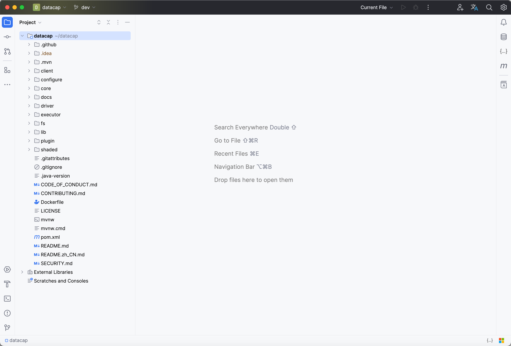
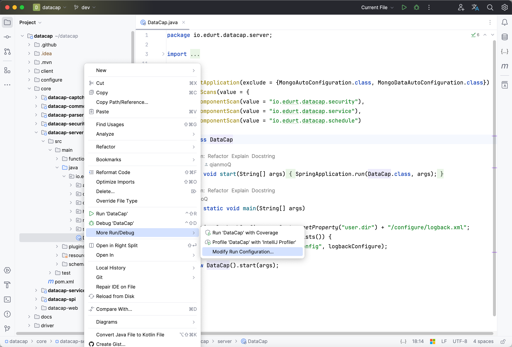

本文章主要用来介绍我们如何来贡献 datacap 服务端源码。

### 准备工作

---

**重要** 克隆源码到本地（如果您需要提交代码到主仓库中需要先将源码 fork 到您的 github 账户中）

```bash
git clone https://github.com/devlive-community/datacap.git
```

!!! note

    如果您已经 fork 源码到您的账户中，请将 `devlive-community` 替换为您的 github 账户的 ID

**重要** 以下是基本的环境配置

| 环境                          | 版本            | 必需 |
|:----------------------------|:--------------|:---|
| `JDK`                       | `1.8` \| `11` | 必须 |
| `Maven`                     | >= 3.5        | 可选 |
| `IDEA` \| `Eclipse` \| `其他` | 任意版本          | 必须 |

!!! note

    在本文中我们使用的是 `IDEA` 编辑器环境，用户可以根据自己喜好更换相应编辑器。

### 加载源码到 IDEA

---

打开 IDEA 编辑器，弹出类似如下窗口


!!! note

    不同的 IDEA 版本，各个按钮的所在位置可能不相同。

点击红框指出的菜单，选择 datacap 源码的根目录，点击打开即可，此时会进入源码的页面，加载完成后窗口如下



左侧展示的是 datacap 源码的各个目录。以下是每个目录的功能：

- `.github`: github 需要的一些 issues 模版，pull request 模版，还有一些 CI 自动化配置脚本等
- `.mvn`: maven wapper 的配置
- `client`: 客户端的相关源码
    - `datacap-cli`: datacap 命令行源码
- `configure`: datacap 相关配置
    - `assembly` datacap 打包用到的各种配置
      - `etc` datacap 服务端配置文件
          - `bin` datacap 服务启动脚本
          - `conf` datacap 服务配置文件
              - `plugins` datacap 插件配置文件
    - `git-forks` datacap fork 主仓库脚本
    - `git-hook` datacap git 本地提交相关 hook
    - `proxy` datacap 服务部署代理配置
    - `publish` datacap 用于发布的各脚本
- `core` datacap 服务端核心源码
    - `datacap-captcha` datacap 验证码源码
    - `datacap-common` datacap 常用工具源码
    - `datacap-parser` datacap SQL 解析器源码
    - `datacap-security` datacap 安全相关源码
    - `datacap-server` datacap 服务端源码
    - `datacap-service` datacap 服务端服务源码
    - `datacap-spi` datacap 服务端 SPI 源码
    - `datacap-web` datacap Web 前端源码
- `docs`: datacap 文档源码
- `driver`: datacap 数据源驱动源码
- `executor`: datacap 执行器源码
- `fs`: datacap 文件系统源码
- `lib`: datacap 依赖包源码
- `plugin`: datacap 插件源码
- `shaded`: datacap 重制依赖源码

### 启动服务

---

找到 `DataCap` 主文件，路径为 `src/main/java/io/edurt/datacap/server/DataCap.java` 在文件上右键，类似下图



弹出类似如下窗口


点击 `Modify options`, 找到 `Program arguments`，并点击它


此时窗口将会变成


在输入框中添加 `--spring.config.location=` 里面的值填写 `configure/etc/conf` 的绝对路径，比如项目在 `/root/datacap` 目录下，那么该值为 `/root/datacap/configure/etc/conf/`

!!! danger

    注意 `conf` 后必须增加 `/` 否则配置会不生效

完成后点击 `OK` 按钮，即可启动服务，访问 `http://localhost:9096/` 成功后，表示服务启动成功。
