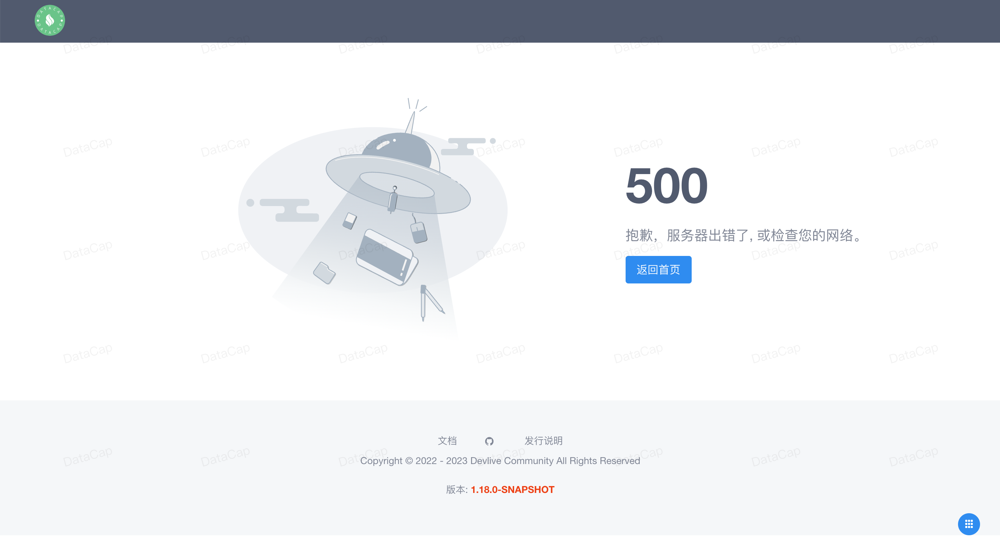

本文章主要用来介绍我们如何来贡献 datacap UI 端源码。

### 准备工作

---

**重要** 克隆源码到本地（如果您需要提交代码到主仓库中需要先将源码 fork 到您的 github 账户中）

```bash
git clone https://github.com/devlive-community/datacap.git
```

!!! note

    如果您已经 fork 源码到您的账户中，请将 `devlive-community` 替换为您的 github 账户的 ID

**重要** 以下是基本的环境配置

| 环境                                | 版本       | 必需 |
|:----------------------------------|:---------|:---|
| `Node`                            | `v18.x`+ | 必须 |
| `yarn`                            | 1.22+    | 必须 |
| `IDEA` \| `Eclipse` \| `WebStrom` | 任意版本     | 必须 |

!!! note

    在本文中我们使用的是 `IDEA` 编辑器环境，用户可以根据自己喜好更换相应编辑器。

可参考 [服务端](../server/home.md) 文档中的 `加载源码到 IDEA` 部分。

### 服务启动

---

- 进入源码目录

```sql
cd core/datacap-web
```

- 安装依赖

```bash
yarn install
```

- 启动服务

```bash
yarn dev
```

返回类似如下信息


通过浏览器访问 `http://localhost:8080` 调试源代码，不要使用 `Network` 返回的地址，看到返回如下页面表示启动成功。



!!! danger

    如果服务端也启动后，系统将会跳转到登录页面。
