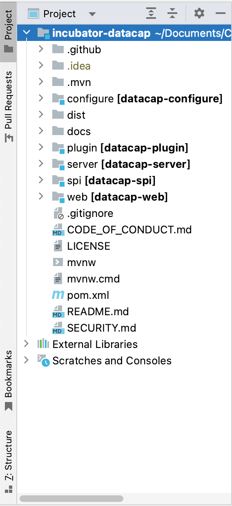

开发环境主要分为两个服务和一个文档模块，以下是对各服务环境构建的详细描述。

### Server

---

!!! warning

    未避免出现不必要问题，请务必阅读依赖环境配置

#### 依赖环境

| 环境      | 版本     | 必要  |
|:--------|:-------|:----|
| `JDK`   | >= 1.8 | 必须  |
| `Maven` | >= 3.5 | 可选  |

#### 源码准备

在代码仓库中fork代码并将代码clone到本地，进入源码目录

```bash
git clone git@github.com:<GitHubUser>/incubator-datacap.git
```

#### 载入源码

打开IDEA加载项目


打开项目后，右侧菜单展示项目目录



- `configure` 项目使用到的一些配置
- `dist` 项目打包后二进制文件存放路径
- `docs` 项目文档源码
- `plugin` 项目插件源码
- `server` 项目主服务源码
- `spi` 项目插件集成核心源码
- `web` 项目web前端源码

#### 服务启动

服务启动需要修改指定配置文件目录


在`Program arguments`中添加`--spring.config.location=`配置

该配置文件内容为当前项目启动服务配置，配置源码在`server/src/main/etc/conf`

服务配置后启动即可，服务启动后访问 `http://localhost:9096/`

### Web

---

!!! warning

    未避免出现不必要问题，请务必阅读依赖环境配置

#### 依赖环境

| 环境     | 版本       | 必要  |
|:-------|:---------|:----|
| `Node` | >= v16.x | 必须  |
| `Npm`  | >= 7.x   | 必须  |

`console-fe` web前端源码都在该目录下

#### 服务启动

- 进入到源码目录

```bash
cd web/console-fe
```

- 启动服务

```bash
yarn run dev
```

命令执行后源码会编译，编译后出现类似以下内容

```java
...
Use /* eslint-disable */ to ignore all warnings in a file.

App running at:
- Local:   http://localhost:8080/ 
- Network: http://192.168.32.53:8080/

Note that the development build is not optimized.
To create a production build, run yarn build.

No issues found.
```

通过浏览器访问 `http://localhost:8080/` 即可调试源码，切勿使用 `Network` 返回的地址

### Docs

---

!!! warning

    未避免出现不必要问题，请务必阅读依赖环境配置

#### 依赖环境

| 环境     | 版本       | 必要  |
|:-------|:---------|:----|
| `mkdocs` | >= 1.3.0 | 必须  |

`docs/docs` 文档源码都在该目录下

#### 服务启动

- 进入到源码目录

```bash
cd docs
```

- 启动服务

```bash
mkdocs serve --dev-addr=0.0.0.0:8001
```

命令执行后源码会编译，编译后出现类似以下内容

```java
...
INFO     -  Documentation built in 1.07 seconds
INFO     -  [13:16:03] Watching paths for changes: 'docs', 'mkdocs.yml'
INFO     -  [13:16:03] Serving on http://0.0.0.0:8001/
INFO     -  [13:16:03] Browser connected: http://0.0.0.0:8001/developer_guide/env.html
```

通过浏览器访问 `http://0.0.0.0:8001/` 即可调试源码
