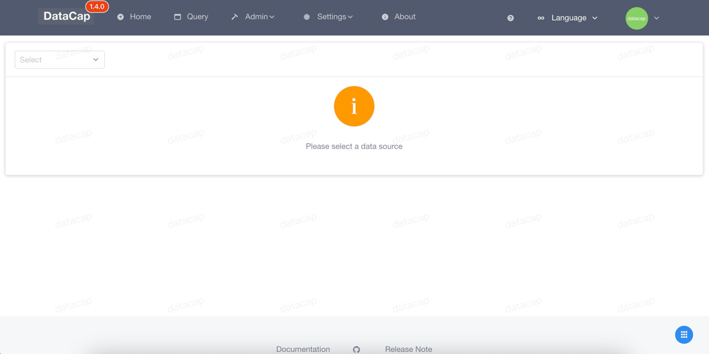
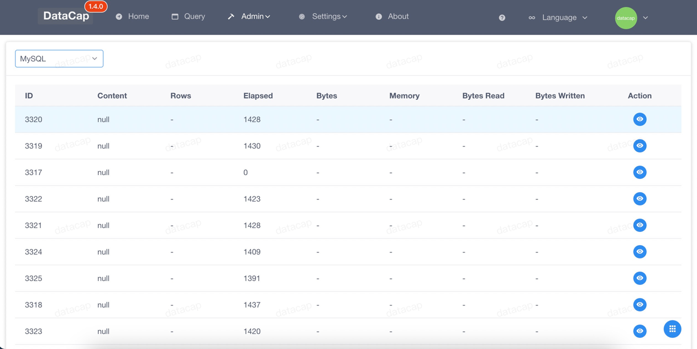
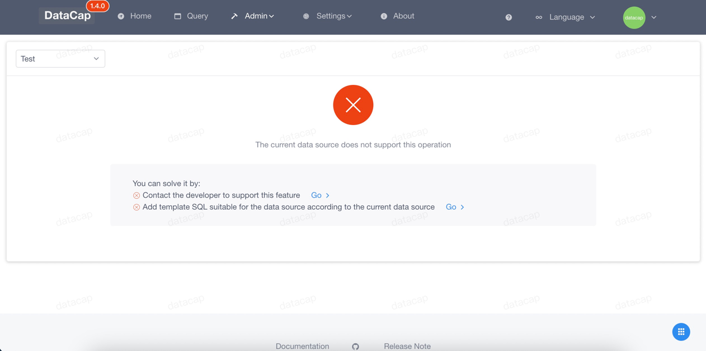

!!! note

    Through the process monitoring function, you can view some specific processes currently being executed by the data source

### View all processes

---

After entering the system, click the corresponding `Processor` submenu under the top `Admin` menu to go to the function configuration function

Select the data source we need to view the process through the drop-down box at the top, and it will be refreshed and displayed in the content area below

!!! danger

    It should be noted that different data sources have different presentation methods

### Not support

---

When we view the unsupported data source, the content of the page is as follows:

The system will prompt us to add SQL template or submit issues to support it
