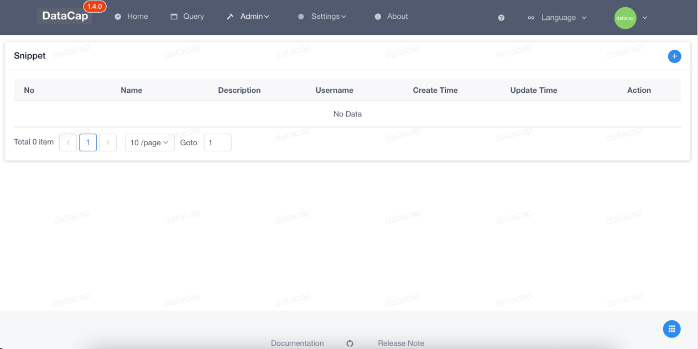
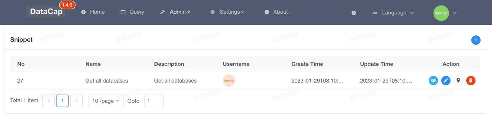

!!! note

    The snippet feature allows you to add support for various custom snippets, perform subsequent snippet operations, and more. The added code snippet is then added to the editor.

Move your mouse over the `Admin` icon in the top menu to pop up the drop-down box, click the `Snippet` submenu in the drop-down box. A window similar to the following pops up, the default list is empty, you need to add it yourself.

If you added a fragment, a page similar to the following appears

### Add Snippet

---

Click the Add button on the right side of the list display area (it is a `+` icon), and after clicking it, the Add Data Source window will pop up as follows

In the window, we need to enter the following

|   Attribute   |                     Description                      |
|:-------------:|:----------------------------------------------------:|
|    `Name`     |        Marks the name of the current snippet         |
| `Description` |      A description of the current code snippet       |
|   `Snippet`   | The specific SQL content of the current code snippet |

After filling in the above, click the `Submit` button at the bottom to save the code snippet.

!!! note

    After the data is saved, the list of data sources is automatically refreshed.

### Review the snippet content

---

Click the first button in `Action` in a data in the list to view the specific code snippet content, and a dialog box will pop up, which is roughly as follows

Click `OK` or `Cancel` to close the dialog box

### Modify the code snippet

---

Click the second button in `Action` in one of the data in the list to modify the snippet, similar to the `Add Snippet` action.

### Quote Snippet

---

Click the third button in `Action` of a piece of data in the list, reference the current code snippet, and you will be taken to the query page, and the fragment content will be entered directly into the editor.

### Delete the snippet

---

Click the fourth button in `Action` of a piece of data in the list to delete the snippet, and the following will pop up after clicking

Click the small pop-up window and click `OK` to remove the snippet.
