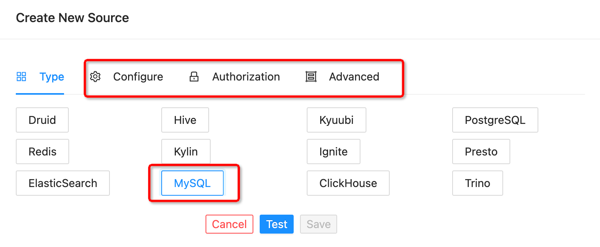
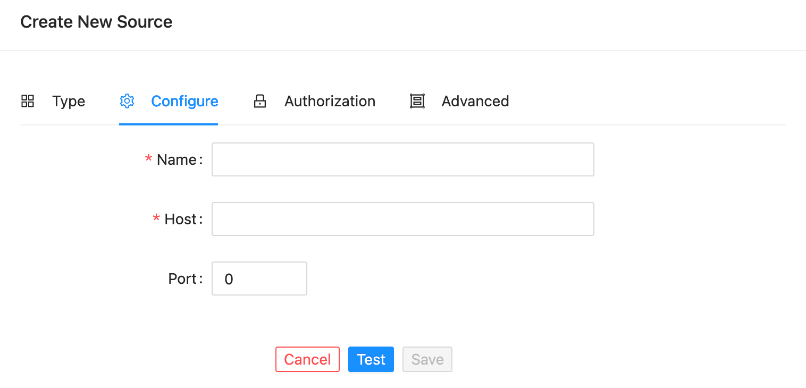
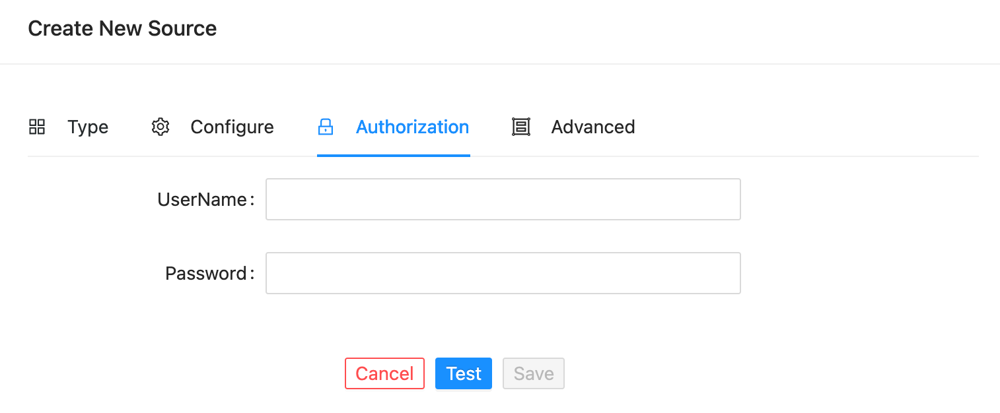
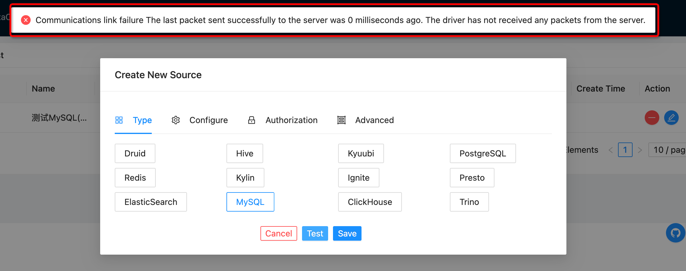

!!! note

    低版本MySQL需要设置 `useOldAliasMetadataBehavior` 参数来支持数据库表列表。

当我们第一次使用系统或需要添加新的数据源时，点击顶部菜单 `Admin` -> `Source` 此时会跳转到数据源管理页面，它的布局如下

默认进入页面后，显示的是添加过的所有数据源列表。

#### 添加数据源

点击页面右上角 :material-plus-circle: 按钮，弹出以下窗口

##### 数据源类型

我们需要选择自己需要添加的数据源类型，比如我们添加一个 MySQL数据源

!!! note

    当我们选择数据源类型后，相对的 `Configure` , `Authorization`, `Advanced` 配置项就会打开

##### 配置基础信息

点击 `Configure` 选项卡

`Name`: 用于定义我们创建数据源的名称

`Host`: 用于配置我们该数据源的主机名或者IP地址

`Port`: 用于配置主机的端口

##### 配置授权信息

!!! danger

    如果您的服务器配置了授权信息，可使用该方式配置，否则可跳过

点击 `Authorization` 选项卡

`UserName`: 服务器授权的账号

`Password`: 服务器授权对应的密码

##### 配置其他信息

!!! danger

    如果您的服务器需要配置了其他信息，可使用该方式配置，否则可跳过

点击 `Advanced` 选项卡

`Catalog`: 部分数据源需要支持

`Database`: 访问的数据库

以上工作完成后我们点击 `Test` 按钮即可进行连接测试，连接成功后会有以下提示

如果无法连接，或其他问题会出现类似以下提示

!!! warning

    具体的错误信息会根据插件的不同返回不同的内容
