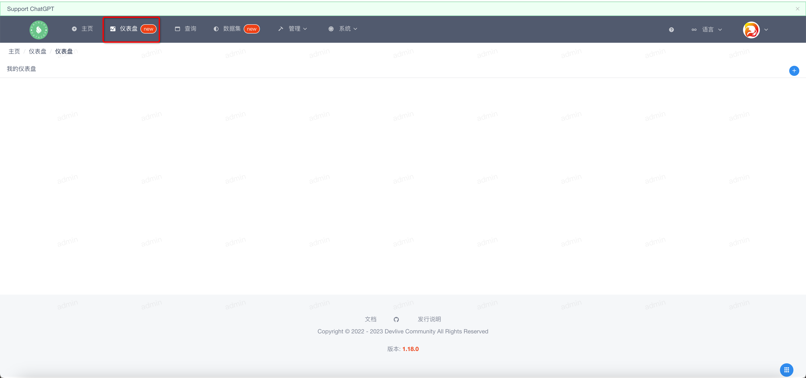
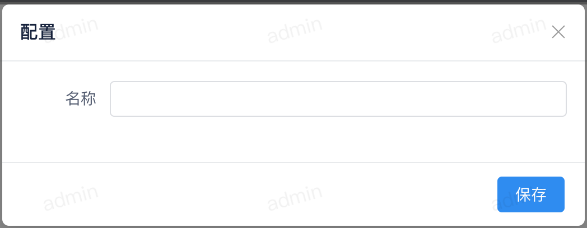

软件安装完成后点击顶部的 `仪表盘` 菜单，进入仪表盘页面。

### 添加仪表盘

---

点击页面左侧的 {width="20"} 按钮弹出如下窗口

页面分为左右两部分：

- 左侧为报表列表
- 右侧为报表展示区

通过左侧拖拽自己需要的报表到右侧即可渲染。报表拖拽完成后点击 {width="20"} 按钮弹出如下窗口

输入仪表盘名称点击保存，确定所有配置后点击 {width="50"} 按钮保存仪表盘

### 预览仪表盘

---

在每个仪表盘下有多个操作菜单，点击预览按钮即可预览仪表盘。

!!! note

    该操作将会跳转到新页面进行仪表盘的显示。

### 编辑仪表盘

---

点击页面右侧的编辑按钮即可编辑仪表盘，页面和添加仪表盘一致

### 删除仪表盘

---

点击页面右侧的删除按钮即可删除仪表盘，弹出如下窗口

在输入框中输入仪表盘名称，点击删除即可删除该仪表盘。
