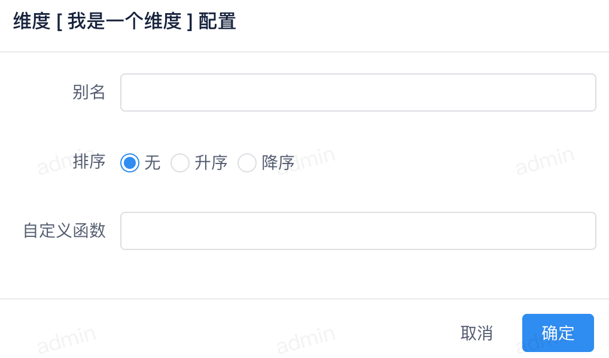
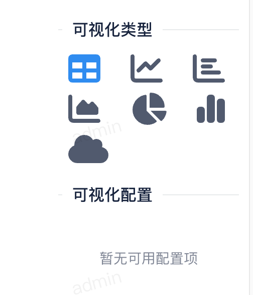

在数据集列表中在每行数据的末尾有 `操作` 按钮，大概如下

我们点击 `操作` 按钮后会跳转到 `即席查询` 页面

页面分为左右两侧，左侧是当前数据集的 `指标` & `维度` 配置，右侧是 `查询` 配置

当拖拽左侧的 `指标` & `维度` 时会在右侧显示查询结果

### 指标配置

当查询列包含指标时，点击配置按钮，弹出如下窗口

可以配置当前指标的 `表达式`，`别名`，`排序`。

!!! warning

    不同的类型指标包含不同的表达式

### 维度配置

当查询列包含维度时，点击配置按钮，弹出如下窗口

可以配置当前维度的 `别名`，`排序`，`自定义函数`。

### 图表配置

当查询成功后，可以配置多种图表类型。

可以根据自己的需求定制目前已经支持的图表。

### 发布图表

图表配置完成后，点击 `发布` 按钮，弹出如下窗口

配置图表的名称后点击 `发布` 按钮，图表发布成功后，可以在图表列表中查看。
