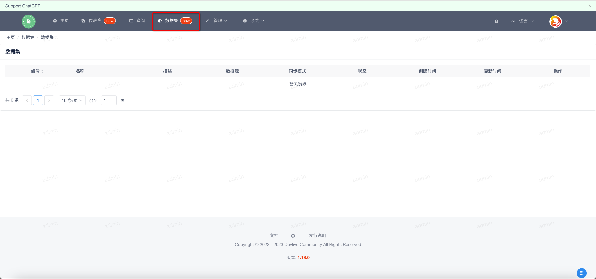
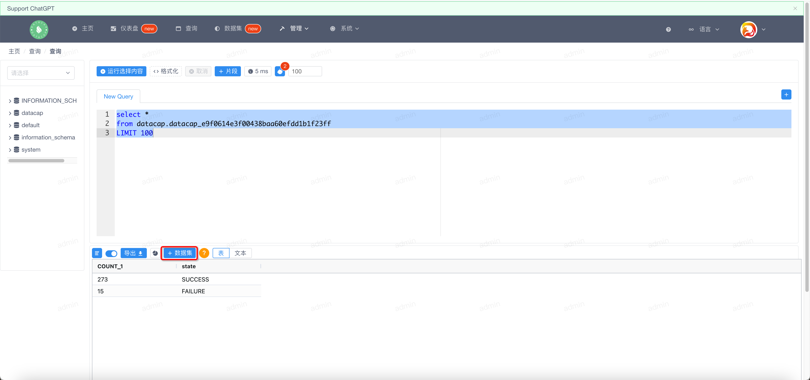
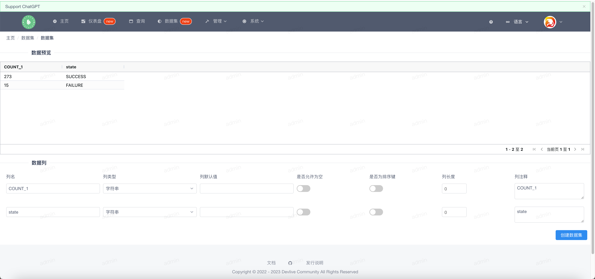
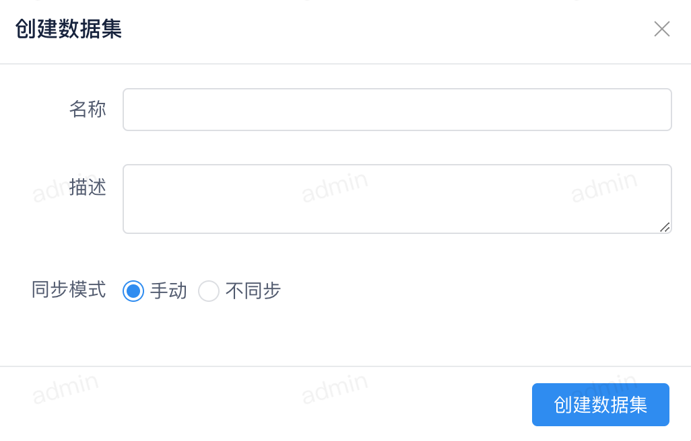
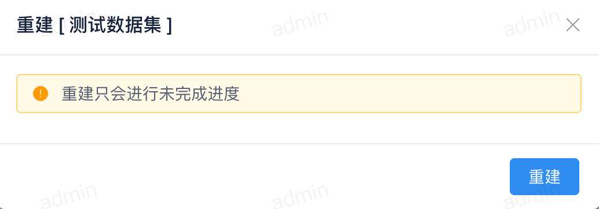
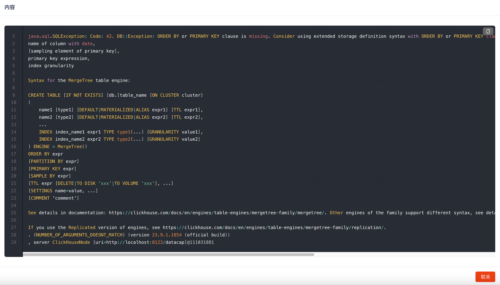

软件安装完成后点击顶部的 `数据集` 菜单，进入数据集页面。

### 添加数据集

---

新建报表功能在查询页面，当我们查询成功后会在结果表格上方显示出如下窗口

点击图中红框选择的按钮，跳转到新建数据集页面

该页面分为两部分顶部为数据预览，底部为当前数据集列配置功能，配置完成后点击底部的 创建数据集按钮弹出如下窗口

在该页面中输入相关信息点击创建数据集即可。

### 重建数据集

---

!!! note

    该操作只会在数据集构建失败后才可以被重新触发。

列表页面查询记录后有操作按钮，点击 {width="20"} 后可以弹出如下窗口

点击底部的重建按钮即可重建数据集。

### 编辑数据集

---

列表页面查询记录后有操作按钮，点击 {width="20"} 后即可跳转到编辑页面，该页面和新增页面一致。

### 查看错误

---

!!! warning

    只有数据集构建失败，才可使用该功能。

点击 {width="20"} 后弹出如下窗口

### 同步数据

---

点击同步数据按钮后，系统将会在后台进行数据同步操作。
