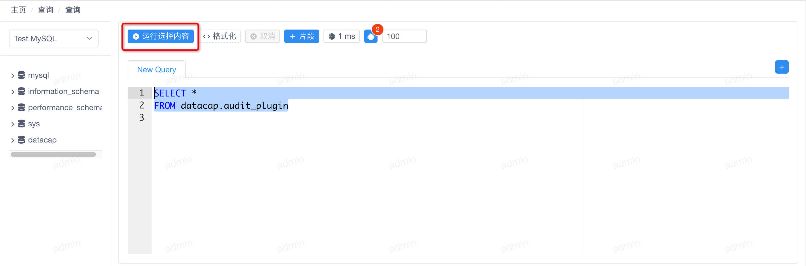
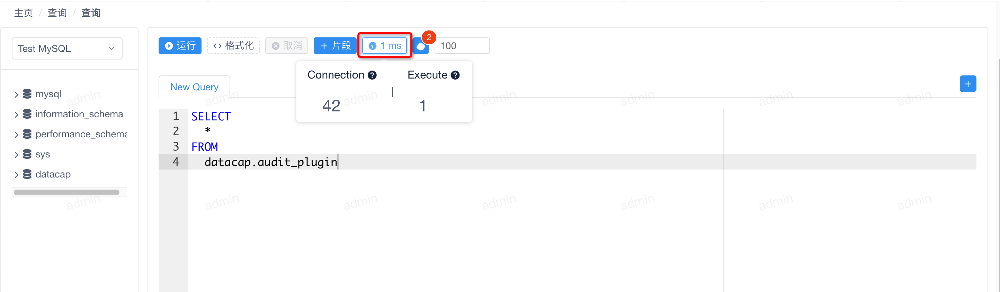
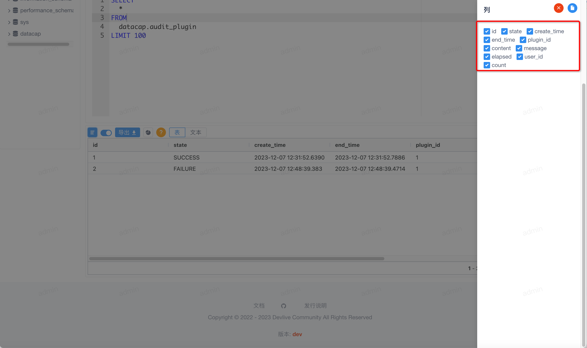

软件安装完成后点击顶部的 `查询` 菜单，进入即席查询页面。

!!! danger

    即席查询需要添加一个数据源，如何添加数据源请前往 [数据源管理]()


## 查询

### 自助查询

---

进入查询页面后，窗口大致如下


查询页面分为左右两部分：

- 左侧为数据源 + 数据源元数据（需要选择数据源后才会展示）
- 右侧为 SQL 编辑器 + 结果展示（需要查询成功后才会展示）

当我们选择数据源后，左侧会展示类似下面的数据源元数据：


此时右侧编辑器上方的工具栏也可以使用，我们在 SQL 编辑器中输入如下语句

```sql
SELECT *
FROM datacap.audit_plugin
```

点击编辑器顶部的 `运行` 按钮，即可查询。当查询成功后，编辑器下方会展示本次查询结果，类似如下


### 选择查询

---

当我们在编辑器中选择执行的 SQL 后，顶部工具栏中的 `运行` 将会变为 `运行选择内容`



### 格式化

---

当我们在编辑器中输入 SQL 后，点击顶部工具栏中的 `格式化` 按钮，即可格式化我们输入的 SQL


### 取消查询

---

当我们在编辑器中输入 SQL 并执行后，点击顶部工具栏中的 `取消` 按钮，即可取消本次查询。

!!! danger

    取消功能并不意味着实际查询结束，查询将继续在后台运行。只是本次查询将不会在接受后续返回的结果。

### 添加片段

---

这是一个片段模块的快捷功能，可以将编辑器中执行成功后的 SQL 快速添加到片段中。后续也可以在编辑器中实现片段的自动填充。

点击按钮后，会在右侧展示如下窗口，填写完成后，保存即可。


### 查询消耗

---

当查询完成后，会在 `片段` 按钮右侧出现一个展示耗时的按钮，点击后可以查看本次查询的消耗时间详情



### AI 分析

---

在 datacap 中接入了 ai 模型，需要用户配置相应的信息方可使用，AI 模型支持

- 解析
- 优化
- 修复问题（只有查询出现错误后，才会出现该功能）

这里我们不多展示，可以自己体验。

### 自动分页

---

在 `AI` 按钮右侧有一个用于输入数字的输入框，他主要用于输入自动添加 LIMIT 的总数量（需要启动该功能，目前为实验性功能）

### 添加编辑器

---

在编辑器上方的右侧有个 `+` 按钮，用于添加编辑器，点击后可以增加一个编辑窗口


### 关闭编辑器

---

当我们添加新的编辑器后，在编辑器名称后有个 `X` 按钮，点击后可以关闭该编辑器


## 结果

默认查询后渲染为普通查询表格，可以在表格的头部做排序，筛选等操作。


### 隐藏列

当点击顶部的 { width="20" } 按钮后，会在右侧弹出当前查询结果渲染的列



我们通过勾选或者取消某列点击顶部的 { width="20" } 即可实现隐藏列。

!!! danger

    该功能并不会重新请求数据，只会在展示端做数据处理。

### 关闭/开启分页

当点击顶部的 { width="20" } 按钮后，会重新渲染下方表格，对表格中的数据进行分页的转换，当关闭分页后回会展示如下


### 导出

目前只支持导出 CSV ，该操作并不会访问后端服务，点击后会导出当前查询的所有返回结果数据。
