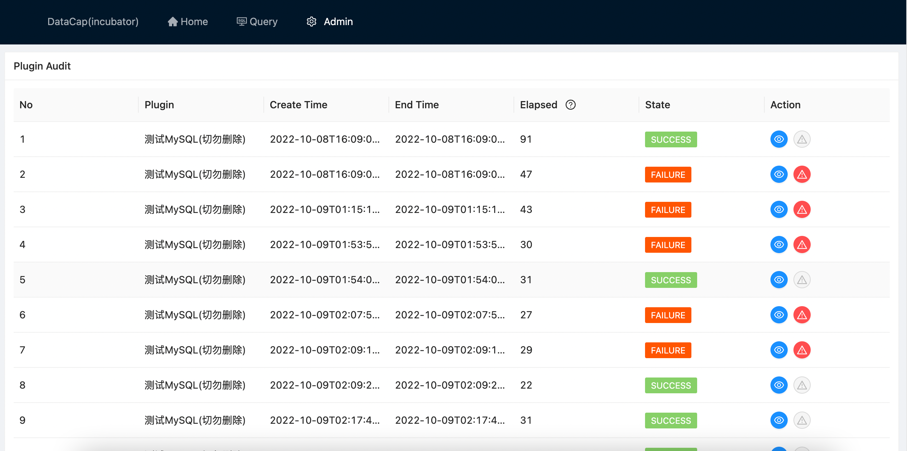
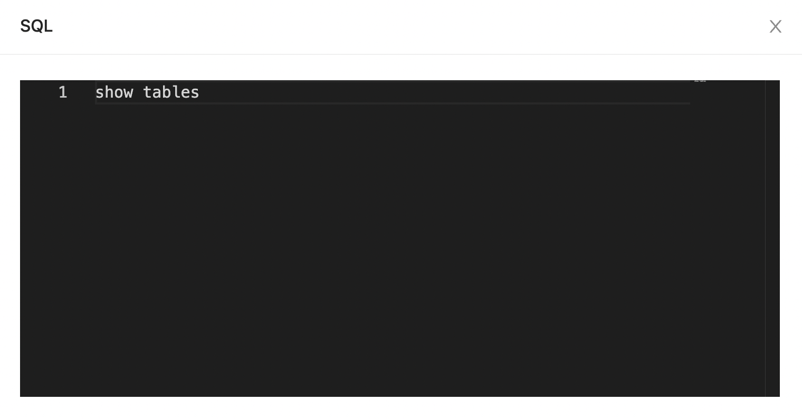

When we use the system for the first time or need to add a new data source, click the top menu `Admin` -> `History` and it will jump to the query history management page, its layout is as follows

After entering the page by default, the query history list of all added data sources is displayed.

|               |                         |
|---------------|-------------------------|
| `No`          | Data number             |
| `Plugin`      | The data source to call |
| `Create Time` | Creation time           |
| `End Time`    | End Time                |
| `Elapsed`     | Total time spent        |
| `State`       | Status                  |
| `Action`      | Additional operation    |

#### Additional operation

Currently there are two additional operations:

##### View execution SQL

Click :material-eye: button，the following window will pop up

The specific SQL statement queried in this query is displayed in the window

##### View execution errors

click :warning: button will pop up the following window

The specific error information of this query is displayed in the window, which is only available when this query fails
