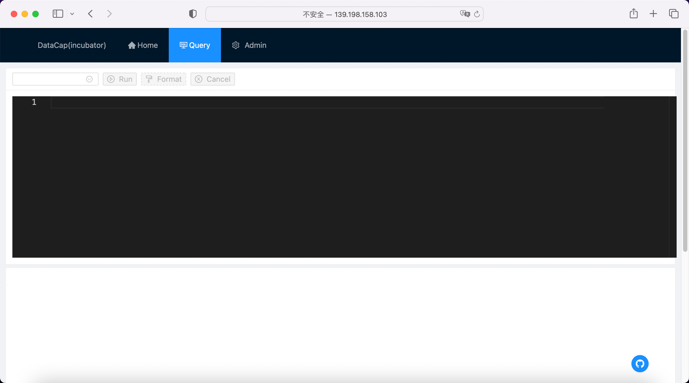

After entering the software UI interface, click the `Query` menu option at the top, and you will enter a page similar to the following:



#### Description

---

The query page is divided into two parts: the upper part is the SQL editor, and the lower part is the query result


There are 4 function boxes at the top of the editor, they are:

- The first one: `selection box` is used to select the data source we have created
- The second: `button` is to perform the operation
- The third: `button` is to format the SQL content we entered
- The fourth: `button` is used to cancel the query that takes too long to execute

!!! danger

    The cancel function does not mean that the actual query is over, and the query will continue to run in the background.

#### Example

---

We use the following SQL for testing

```sql
show databases
```

After we write the SQL into the editor, click the second function button at the top of the editor to run it. After running, a window similar to the following will be displayed:


The result window is divided into: the top menu is the data export function, which currently supports `CSV` export, and the lower part is the data result display.

!!! note

    The specific result display content is returned according to the SQL query by the user

#### Data output

---

Move the mouse to the top menu of the result display area, and a drop-down box will appear. Click the type to be exported, and a download dialog box will pop up, and the data can be downloaded to the local.
