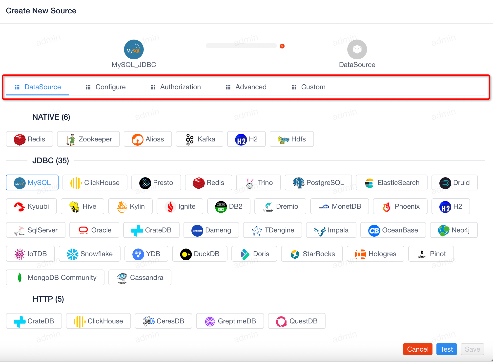
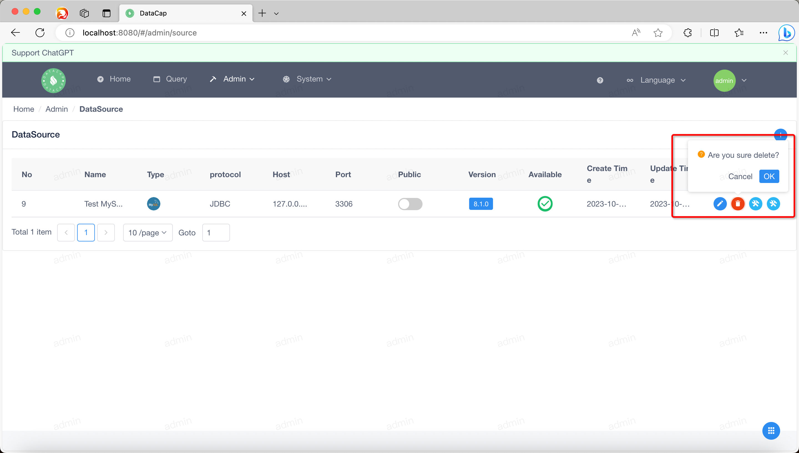
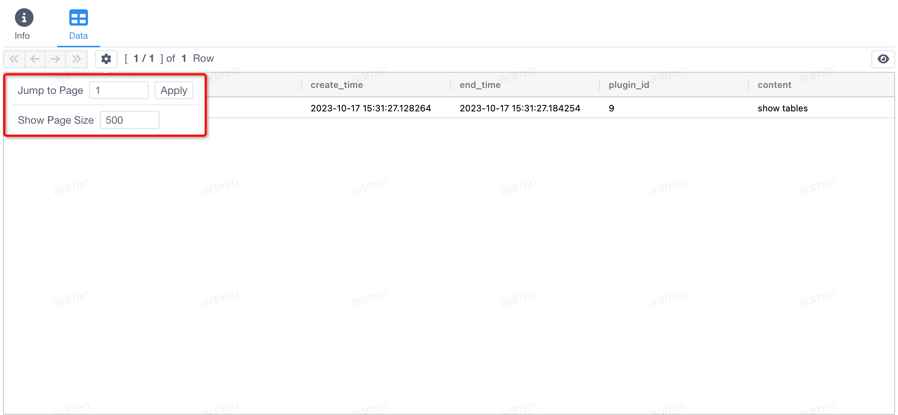

!!! note

    Through the data source feature, you can add support for various custom data sources, perform subsequent data source operations, and so on.

Move the mouse over the `Admin` logo of the top menu, the drop-down box will pop up, click the first submenu in the drop-down box. A window similar to the following pops up, the default list is empty, you need to add it yourself.

If you added a data source, a page similar to the following appears

### Add a data source

---

Click the Add button on the right side of the list display area (it is a `+` icon), and after clicking it, the Add Data Source window will pop up as follows

When we select a certain type of data source, the data source configuration information will be displayed in the top tab bar, different data sources have different configuration items, and its configuration order is in the specified directory of service startup.

When we select the source of type `MySQL`, a window similar to the following pops up

4 tabs appear in the configuration page, click on the different tabs to fill in the relevant information, and then click the `Test` button at the bottom, the following page will pop up:

When the data source is successfully tested, the version number of the current service will be displayed at the top, and you can save the data by clicking the `Save` button at the bottom.

!!! note

    After the data source is saved, the list of data sources is automatically refreshed.

### Modify the data source

---

Click the first button in `Action` in a data source in the list to modify the data source, similar to the `Add Data Source` action

### Delete the data source

---

Click the second button in `Action` for a data source in the list to delete the data source, and the following will pop up after clicking

Click the small pop-up window and click `OK` to delete the selected data source.

!!! danger

    It is important to note that when a data source is deleted, the query history associated with the data source is deleted.

### Data source management

---

Click the third or fourth button in the `Action` of the data source in the list to jump to the data source management page.

The page is divided into two parts: left and right. The left side mainly displays the basic information of the data source, including:

- Select the relevant metadata for the data source

#### Information module

When we select the database and data table on the left, the content on the right is displayed as follows

Two tabs appear in the right content:

- `Info`（Default options）
- `Data`

!!! note

    By default, information about the current table is displayed under the Current tab.

#### Data modules

Click the `Data` tab and a page similar to the following will appear, which displays the relevant data of the currently selected table.

The four buttons at the top are:

- `First Page`
- `Previous Page`
- `Next Page`
- `Last Page`

The next button is to set the configuration for the data query:

- `Jump to Page`
- `Show Page Size`

Once the configuration is populated, click the `Apply` button to apply the current configuration information.

There is also a button on the right, which will display the detailed `SQL` content used by the current query

!!! note

    The current SQL generation is based on the order in which it is synchronized to the metadata.

!!! danger

    At present, not all data sources support management, you can add your own templates if needed. If you are interested, you can contribute the source code to us.
