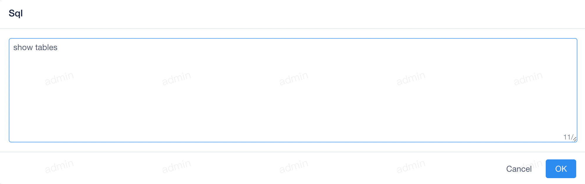

鼠标移向顶部菜单的 `Admin` 标识下，会弹出下拉框，点击下拉框中的 `History` 子菜单。弹出类似如下窗口，默认列表为空，通过查询页面进行查询即可自动添加记录。

### 查看执行 SQL

---

点击列表中某个数据中 `Action` 中的第一个按钮，查看具体的代码片段内容，会弹出一个对话框，大致如下

此查询中查询的特定 SQL 语句将显示在窗口中。

### 查看执行错误

---

!!! danger

    只有查询出现异常情况下，才可以查看错误信息。

点击列表中某个数据中 `Action` 中的第二个按钮即可查看错误信息

