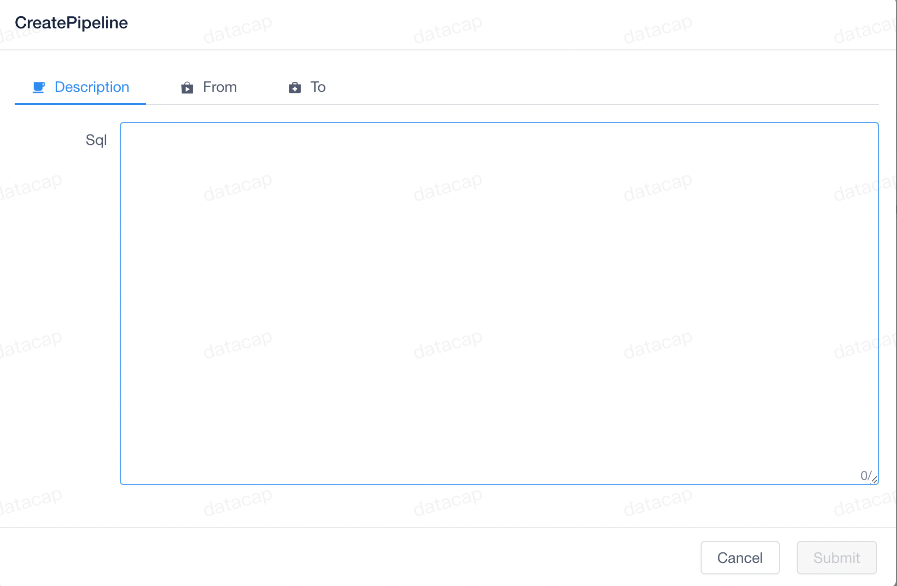
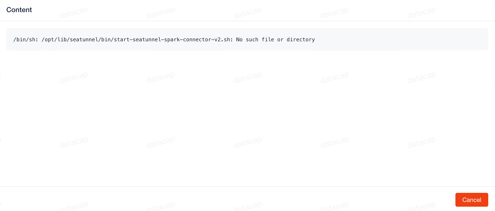

In the DataCap software, the pipeline is a tool for users to perform some data operations such as data migration.

### Build pipeline

---

After entering the system, click the corresponding `Pipeline` submenu under the `Admin` menu at the top to enter the pipeline list by default. Similar to the picture below:

Click the `+ Create` button on the right side of the list, and the system will pop up the configuration page:

The configuration page is divided into three configuration modules, namely:

- `Description` mainly configures the SQL executed by the user
- `From` configures the data access source
- `To` configure data output source

Each data source has different configuration properties. After selecting the data source, just follow the prompts to configure the relevant properties.

When the task is successfully published, the task list will be refreshed by default, as shown in the following figure:

### Pipeline management

---

After the task is released, it will be started by default. The `Action` operation on the right side of the task contains the following functions:

#### View errors

When we click the first button in `Action`, the system will pop up an error message page.

> This feature will only be enabled if the task fails

#### View log

When we click the second button in `Action`, the system will pop up the log page.

#### Task stopped

When we click the third button in `Action`, the system will pop up the stop task page.

> This feature will only be enabled when the task is running

We enter the task name according to the information prompted in the window and click the `Stop` button.

#### Task deletion

When we click the fourth button in `Action`, the system will pop up the delete task page.

We enter the task name according to the information prompted in the window and click the `Delete` button.
