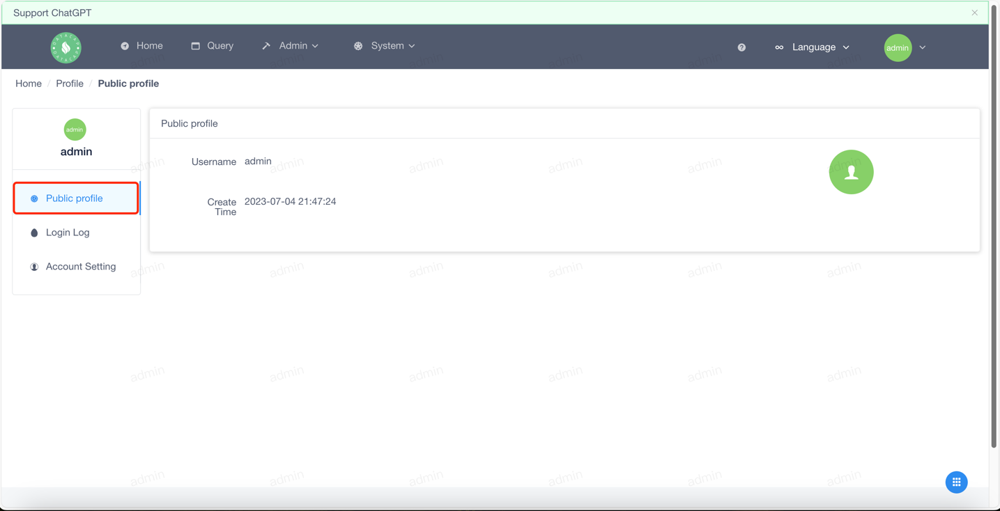
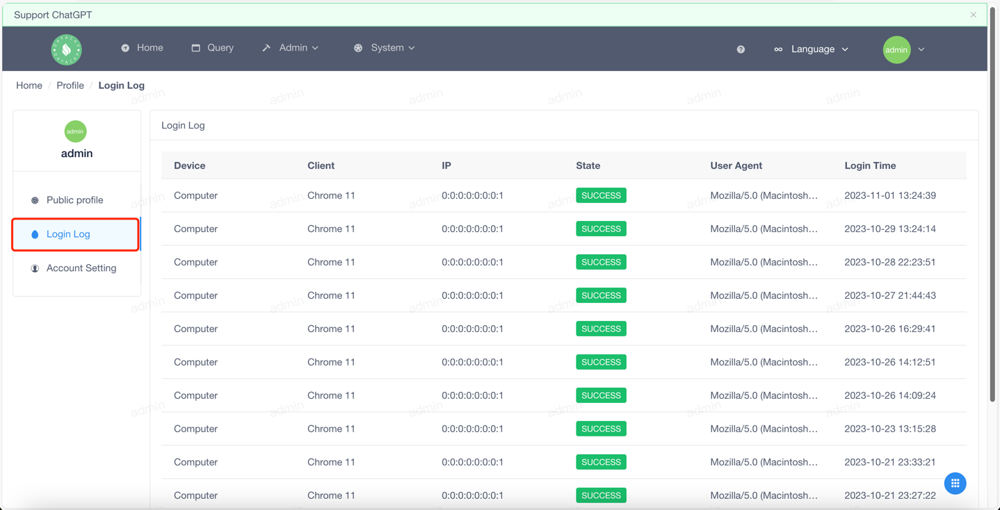
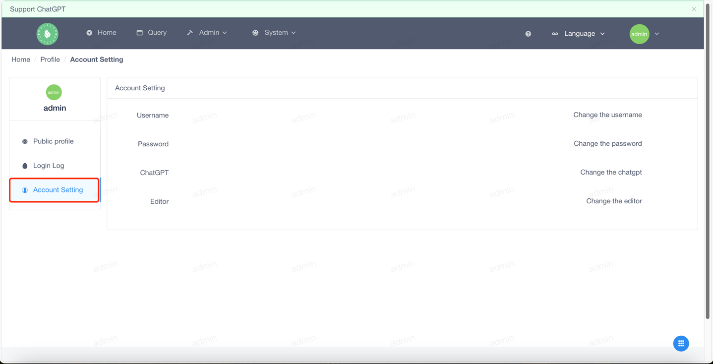
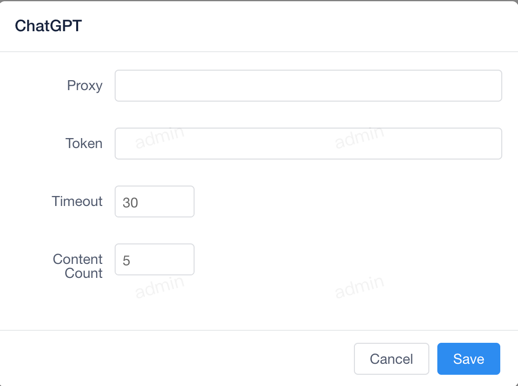

!!! note

    The profile feature provides an overview of some of the query history and data source usage of individual users.

Hover the mouse over the avatar menu on the far right of the top menu, a drop-down box will pop up, click the first submenu in the drop-down box. A window similar to the following pops up:

First of all, the top chart we see is the query calendar chart for the past year. It is calculated based on the summary of the total number of queries per day.

The second chart shows the data source usage in the last 7 days. It is calculated based on a daily summary of data source usage.

### Profile

---

When you click on the profile button (the first button on the left menu), you will see a pop-up window like this:

This page mainly displays the basic information of the profile.

### Login logs

---

When you click the login log button (the second button on the left menu), the following window will pop up:

This page displays the login logs of the current user, including the login time, login location, and login method.

### Account Settings

---

When you click on the Account Settings button (the third button on the left menu), the following window will pop up:

This page mainly shows some of the configuration functions that users can make.

#### Username

---

When you click the Modify Username button, the following window will pop up:

Enter the modified username and current password, and click the OK button to complete the modification.

!!! danger

    It should be noted that after changing the user name, you need to log in again. The system will log out of the current account by default.

#### Password

---

When you click the Change Password button, the following window will pop up:

Enter the original password and the new password, and click the OK button to complete the modification.

!!! danger

    It should be noted that after changing the password, you need to log in again. The system will log out of the current account by default.

#### ChatGPT

---

When you click the ChatGPT button, the following window will pop up:

This page mainly shows some of the configuration features that ChatGPT can do.

#### Editor

---

When you click the editor button, the following window will pop up:

When you modify the editor, the modified configuration is synchronized to all locations in the system that use the editor.

The editor's changes are WYSIWYG and show the current configuration scheme in real time.