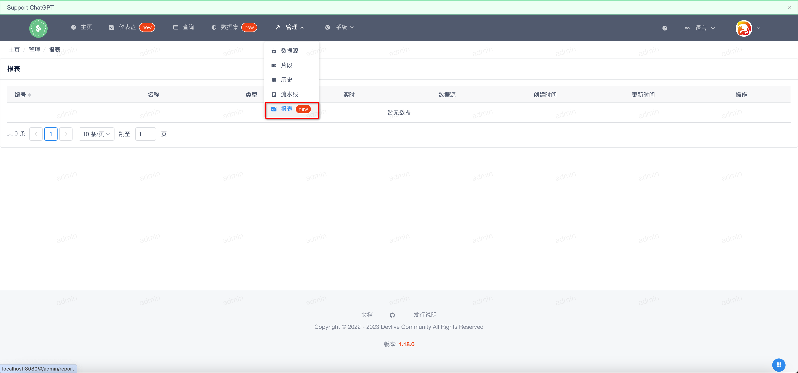
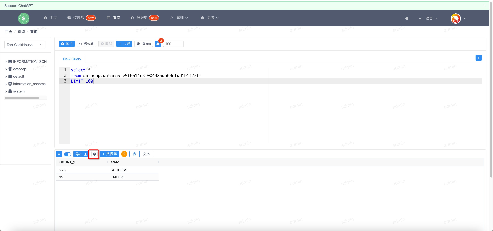
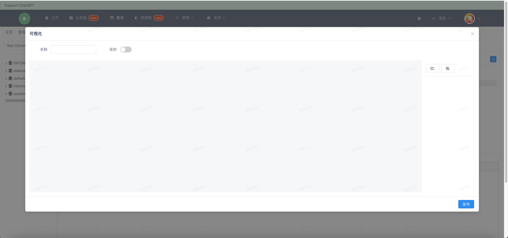
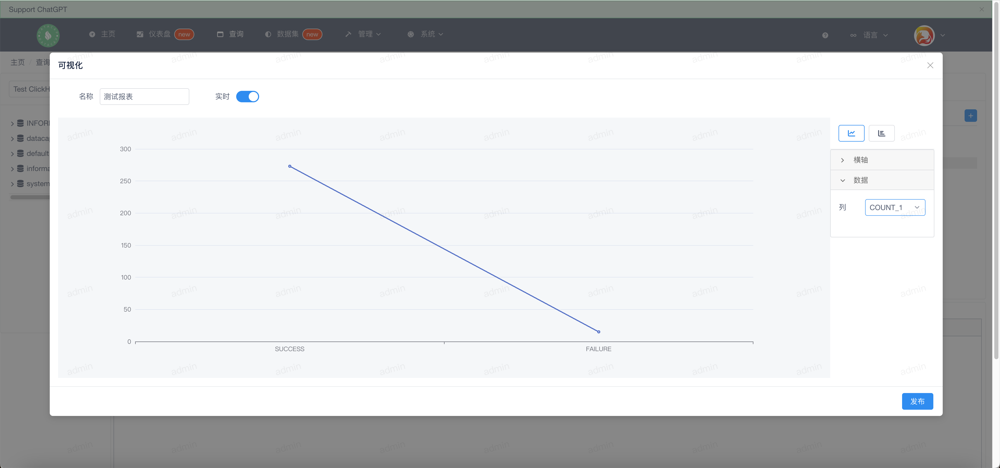
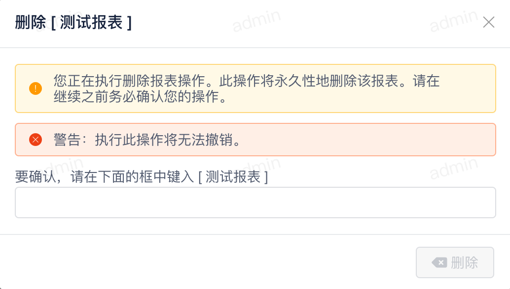

鼠标移向顶部菜单的 `Admin` 标识下，会弹出下拉框，点击下拉框中的 `Report` 子菜单。弹出类似如下窗口，默认列表为空，通过查询页面进行查询即可添加报表。

### 新建报表

---

新建报表功能在查询页面，当我们查询成功后会在结果表格上方显示出如下窗口

点击图中红框选择的按钮，弹出如下窗口

顶部为报表名称和是否实时报表

!!! note

    如果是实时报表，那么报表数据会在展示时进行后端服务查询从而渲染，不同的查询引擎这可能会造成报表渲染慢的问题。非实时报表只会展示当前查询的静态数据。

左侧是报表渲染区域，右侧为报表的配置，目前支持报表的类型：

- 折线图
- 柱状图

以下是一个我们配置好的报表：

报表配置完成后，点击发布即可将报表保留下来。

### 查看报表

---

在报表列表页面查询记录后有操作按钮，操作按钮的第一个 { width="20" } 点击后可以查看报表

### 删除报表

---

在报表列表页面查询记录后有操作按钮，操作按钮的第二个 { width="20" } 点击后可以弹出如下窗口

在输入框中输入报表名称，点击删除即可删除该报表。
