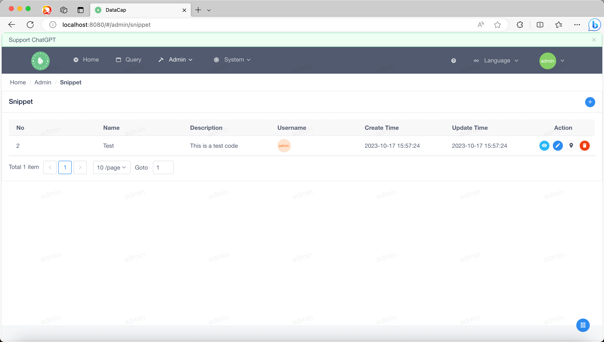

!!! note

    通过代码段功能，可以添加对各种自定义代码段的支持，并执行后续的代码段操作等。添加的代码片段后续会添加到编辑器中。

鼠标移向顶部菜单的 `Admin` 标识下，会弹出下拉框，点击下拉框中的 `Snippet` 子菜单。弹出类似如下窗口，默认列表为空，需要自行添加。

如果您添加了片段会显示类似如下页面

### 添加片段

---

点击列表展示区域的右侧添加按钮（它是一个 `+` 图标），点击后将弹出如下添加数据源窗口

在窗口中，我们需要输入以下内容

|      属性       |        描述        |
|:-------------:|:----------------:|
|    `Name`     |    标记当前代码段的名称    |
| `Description` |    当前代码片段的说明     |
|   `Snippet`   | 当前代码片段的特定 SQL 内容 |

填写完以上内容后，点击底部的 `Submit` 按钮保存代码片段。

!!! note

    数据保存后，数据源列表会自动刷新。

### 查看代码段内容

---

点击列表中某个数据中 `Action` 中的第一个按钮，查看具体的代码片段内容，会弹出一个对话框，大致如下

单击 `OK` 或 `Cancel` 关闭对话框

### 修改代码段

---

点击列表中某个数据中 `Action` 中的第二个按钮即可修改代码段，该操作类似于 `添加片段` 操作。

### 引用片段

---

点击列表中某个数据的 `Action` 中的第三个按钮，引用当前代码片段，会跳转到查询页面，片段内容会直接输入到编辑器中。

### 删除代码段

---

点击列表中某个数据的 `Action` 中的第四个按钮，删除代码段，点击后会弹出以下内容

单击弹出的小窗口，然后单击 `OK` 以删除代码段。
