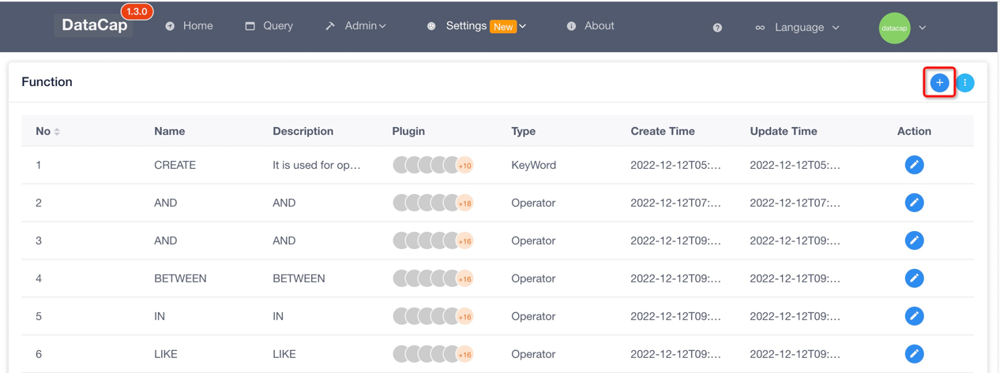

!!! note

    We can enhance the automatic prompt function of the code editor through the function module provided by the system.

### System default function

---

The system has built-in the following data source functions by default (it does not mean that it is the most complete function of the new version, if there is something missing, please submit issues or pr to fix it):

- ClickHouse
- MySQL
- Hive
- Trino & Presto (fit a part)

### Add function

---

After entering the system, click the corresponding `Function` submenu under the top `Settings` menu to go to the function configuration function



Click the Add button on the top right to add a new function, and the following window will pop up after clicking:


The following is a detailed parameter description:

- `Name`: The name used to mark the function prompt, the suggestion is English
- `Plugin`: The plugin this function applies to, multiple options can be selected
- `Content`: The specific content of the function, which will be entered into the editor
- `Description`: Description of the function
- `Type`: Type of function, can be: `KeyWord`, `Operator`, `Function`, default is `KeyWord`
- `Example`: For the use example of this function, it is convenient for users to understand how to use the function

When the above content is written, click the `Submit` button at the bottom to save the operation, and you can use it in the editor later.

### Batch operation

---

The system provides a way to import functions in batches. Currently, it supports the import of content and URI addresses. Next, let's take a look at how to do it.

We perform the batch import function by clicking the import button on the top right.

#### Content import


The content import method allows us to enter a list of functions, and they are divided according to each line. Adding the following keywords we need to import:

```sql
SHOW
USE
```

In `Plugin`, we choose to use the `ClickHouse` plug-in, and in `Type`, we choose `KeyWord`. After the operation is completed, we click the `Submit` button at the bottom to use the import function of the current input function.

#### URI import

The URI import method is relatively simple. We can import data in batches by specifying the remote server URI address, which can be your local server address or the address provided by the software.

The URI address format provided by the software by default is

```sql
(http|https)://datacap.edurt.io/resources/functions/plugin/keywords.txt
(http|https)://datacap.edurt.io/resources/functions/plugin/operators.txt
(http|https)://datacap.edurt.io/resources/functions/plugin/functions.txt
```

We only need to replace the value of plugin in the address with the name of the plugin that needs to be imported.

!!! warning

    It should be noted that due to local network problems, the URI import method may be slow.
