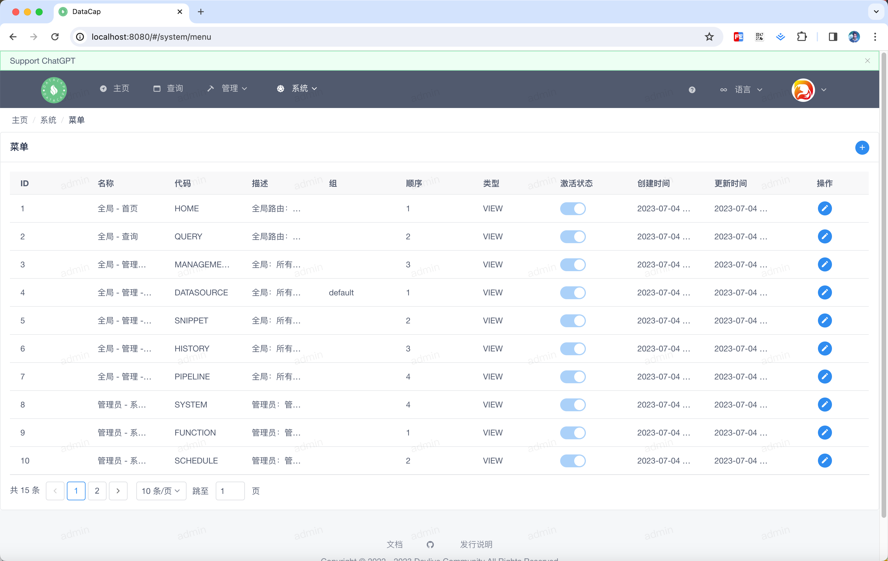

鼠标移向顶部菜单的 `Admin` 标识下，会弹出下拉框，点击下拉框中的 `Menu` 子菜单。弹出类似如下窗口，默认列表为空，通过查询页面进行查询即可自动添加记录。

### 新建菜单

---

点击列表展示区域的右侧添加按钮（它是一个 + 图标），点击后将弹出如下添加数据源窗口

填写完以上内容后，点击底部的 `Submit` 按钮保存代码片段。

!!! note

    数据保存后，数据源列表会自动刷新。

### 修改菜单

---

点击列表中某个数据中 `Action` 中的第一个按钮，会弹出修改窗口，它和新建菜单一致。
