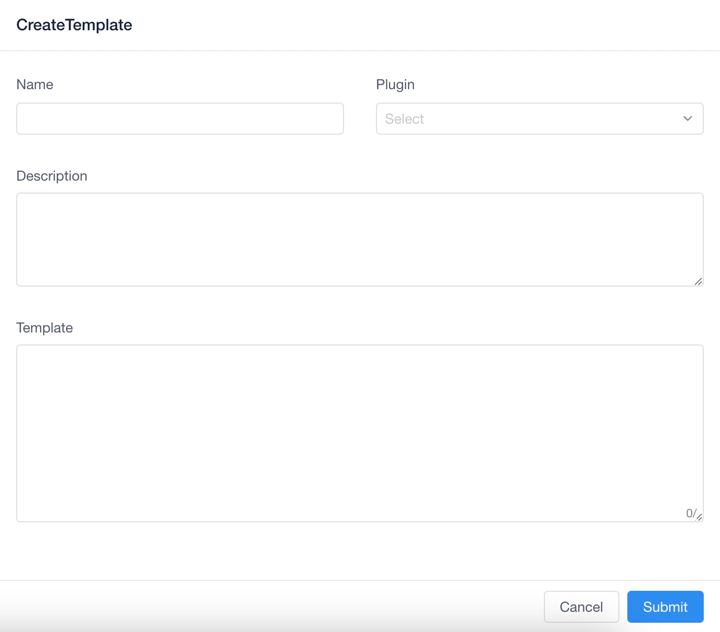

!!! note

    The system supports the SQL template function, through which the realization of some monitoring and other functions can be supported.

#### Default template

---

The system supports some default templates, currently supports:

- `getAllDatabaseAndTable`
- `getAllDatabase`
- `getAllTablesFromDatabase`

Of course, each template can support one or more plug-ins, and they will be used in subsequent operations of the system.

#### Add template

After entering the system, click the corresponding `Sql` submenu under the top `Settings` menu to go to the function configuration function


Click the Add button on the top right to add a new function, and the following window will pop up after clicking:



The following is a detailed parameter description:

- `Name`: The name used to mark the function prompt, the suggestion is English
- `Plugin`: The plugin this function applies to, multiple options can be selected
- `Description`: Description of the function
- `Template`: The SQL statement executed by the template

When the above content is written, click the `Submit` button at the bottom to save the operation, and you can use it in the editor later.

!!! warning

    The default template does not carry any parameters and we can execute it directly.

##### Dynamic parameter template

We can realize the template dynamic parameter passing function by defining variables. Let's take an example, we need to display all the data tables under the `default` database, the normal SQL is

```sql
SHOW TABLES FROM default
```

When we use the template, the SQL changes to

```sql
SHOW TABLES FROM ${database:String}
```

The system parses the parameter into `database=String` by collecting `{database:String}` expression, where `database` is the parameter name, and `String` is the type of parameter passing.

When we use the expression time, we only need to pass the `Map` type parameter, where key=parameter name, value=data value passed according to the type.