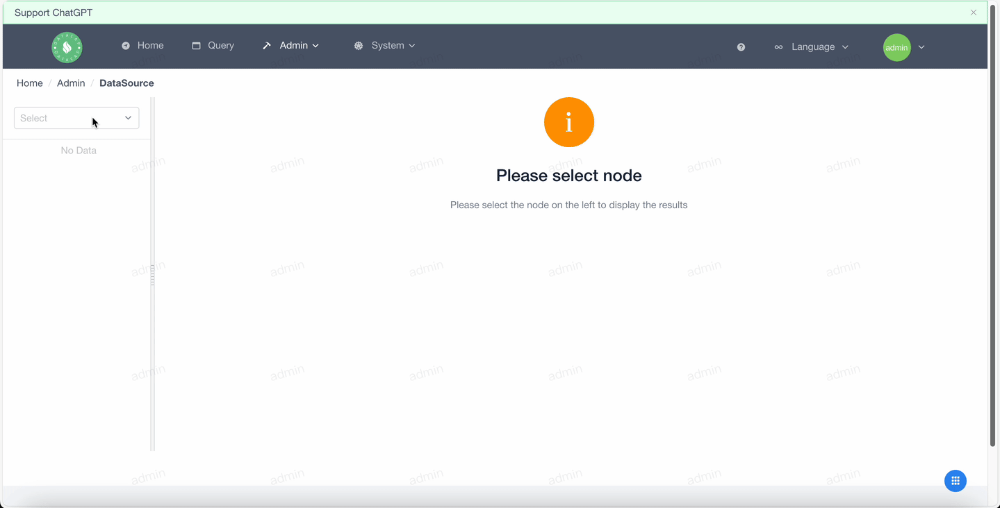
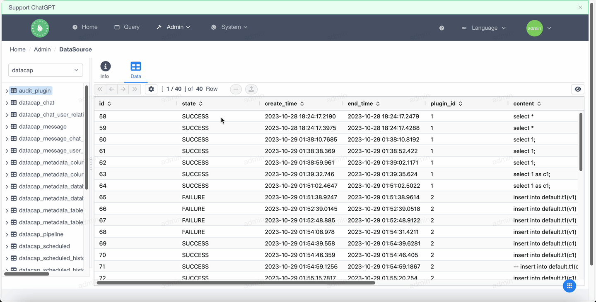
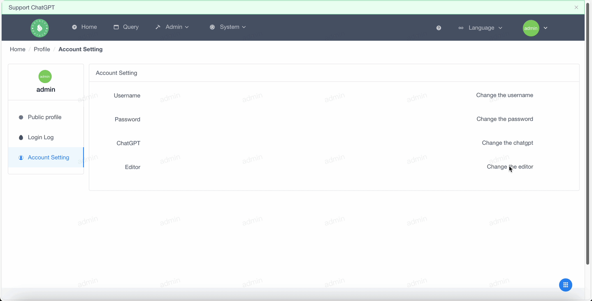

!!! note

    The current release involves several major updates.

**DataCap is released!**

| Release Version  | Release Time |
|:----------------:|:------------:|
|     `1.16.0`     | `2023-11-01` |

#### General

---

- Support column order

- Support delete rows
- Support delete multiple rows

- Supports data update without primary key

- Supports data update with primary key

- Support preview pending changes

#### Editor

---

- Support selection query

- Support custom configure

#### Docs

---

- Add user profile doc

#### Dependencies

---

- Bump org.apache.maven.plugins:maven-javadoc-plugin from `3.5.0` to `3.6.0`
- Bump com.oceanbase:oceanbase-client from `2.4.2` to `2.4.5`
- Bump org.apache.maven.plugins:maven-javadoc-plugin from `3.5.0` to `3.6.0`
